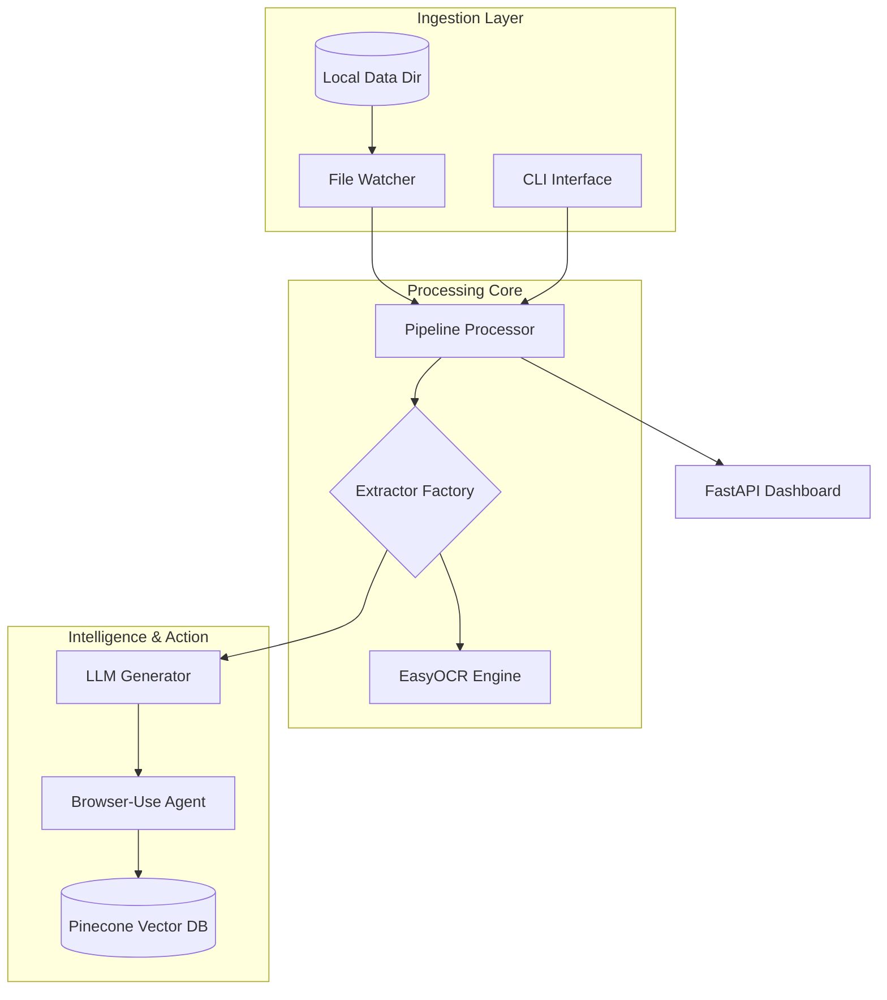
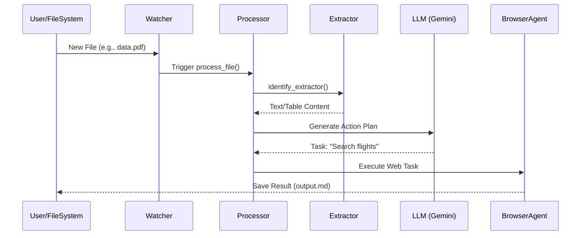
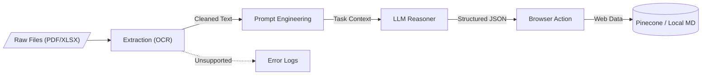

<!--
  Generated by AI-Powered README Generator
  Repository: https://github.com/WomB0ComB0/browser-use
  Generated: 2026-01-31T06:55:23.966Z
  Format: md
  Style: comprehensive
-->

# Enterprise Data Pipeline (Browser-Use)

An automated, LLM-powered data extraction and web-automation pipeline designed to transform unstructured files into actionable insights and execute complex browser tasks.


## 2. Table of Contents
- [Overview](#overview)
- [Features](#features)
- [Architecture](#architecture)
- [Quick Start](#quick-start)
- [Usage & Examples](#usage--examples)
- [Configuration](#configuration)
- [API Reference](#api-reference)
- [Development](#development)
- [Troubleshooting](#troubleshooting)
- [Contributing](#contributing)
- [Roadmap & Known Issues](#roadmap--known-issues)
- [License & Credits](#license--credits)

## 3. Overview
The **Enterprise Data Pipeline** is a robust framework built to bridge the gap between static data extraction and dynamic web action. It monitors local directories for various file formats (PDF, XLSX, CSV, JSON, etc.), extracts their content using specialized engines (including OCR), and passes that data to Large Language Models (LLMs) like Google Gemini or Ollama. 

Unlike traditional ETL tools, this pipeline integrates **Browser-Use**, allowing the system to not only analyze data but also act upon it—such as navigating websites, performing price comparisons, or filling out web forms based on the processed information. It provides a seamless transition from document ingestion to automated browser execution.

**Who is this for?**
*   **Data Engineers** building automated document processing workflows.
*   **RPA Developers** looking for LLM-native browser automation.
*   **Analysts** needing to automate repetitive data-gathering tasks from the web.
*   **DevOps Teams** requiring a self-healing, file-triggered execution engine.

## 4. Features

### 📂 Multimodal Extraction
*   ✨ **Universal Support:** Native extractors for `.txt`, `.md`, `.json`, `.csv`, `.pdf`, and `.xlsx`.
*   👁️ **OCR Integration:** Built-in `easyocr` support for processing scanned images and complex PDF layouts.
*   ⚡ **Async Processing:** Concurrent file handling using `aiofiles` and multi-worker architecture.

### 🤖 LLM & Browser Automation
*   🎯 **Browser-Use Integration:** Seamlessly control Chromium-based browsers via LLM instructions.
*   🧠 **Dual Provider Support:** Use Google Gemini (Native or LangChain) for cloud-scale or Ollama for local-first privacy.
*   🔄 **Workflow Orchestration:** Define complex multi-step tasks in YAML (e.g., Code Review, Data Analysis).

### 🛠️ Enterprise Ready
*   📊 **Real-time Dashboard:** Built-in FastAPI/Websocket dashboard for monitoring pipeline health.
*   💾 **Vector Memory:** Integrated Pinecone service for long-term document context and RAG.
*   🕵️ **File Watcher:** Robust `watchdog` implementation to trigger events on file creation or modification.

## 5. Architecture

### System Component Map


### Sequence: File Processing Flow


### Data Transformation Flow


### Tech Stack
| Layer | Technology | Purpose |
| :--- | :--- | :--- |
| **Language** | Python 3.10+ | Core logic and scripting |
| **LLM Interface** | LangChain / ChatGoogle | Abstracted LLM communication |
| **Automation** | Playwright / Browser-Use | Headless browser control |
| **Database** | Pinecone | Vector storage for RAG workflows |
| **UI** | FastAPI / Rich | Dashboard and CLI feedback |

## 6. Quick Start

### Prerequisites
*   Python 3.10 or higher
*   Playwright dependencies: `playwright install`
*   (Optional) Tesseract/EasyOCR dependencies for images

### Installation
1.  **Clone the repository:**
    ```bash
    git clone https://github.com/WomB0ComB0/browser-use.git
    cd browser-use
    ```

2.  **Install dependencies:**
    ```bash
    pip install -r requirements.txt
    playwright install chromium
    ```

3.  **Configure Environment:**
    ```bash
    cp .env.example .env
    # Edit .env with your GEMINI_API_KEY
    ```

### Hello World (Agent Demo)
Run the native Gemini agent to perform a web search task:
```bash
python demo_gemini_native.py
```
**Expected Output:**
```text
Agent: Searching for JFK to LHR flights...
Result: The cheapest flight found is $458 via Norse Atlantic.
```

## 7. Usage & Examples

### 1. Running the Pipeline
The pipeline can run in "Watch Mode" to monitor a directory continuously for incoming documents.
```bash
# Start watching the data/ directory
python run_pipeline.py start --config config.yaml
```

### 2. Processing a Specific File
For one-off tasks, use the `process` command to bypass the watcher:
```bash
python run_pipeline.py process ./data/sample_users.txt --workflow data_analysis
```

### 3. Integrated Dashboard
Monitor your agents and file processing status via the web UI:
```bash
python -m pipeline.dashboard.app
# Open http://localhost:8000
```

<details>
<summary>Advanced: Programmatic Usage</summary>

```python
from pipeline.config import PipelineConfig
from pipeline.processor import PipelineProcessor

async def custom_run():
    cfg = PipelineConfig.load("config.yaml")
    processor = PipelineProcessor(cfg)
    await processor.initialize()
    
    # Manually trigger processing
    result = await processor.process_file("path/to/data.pdf")
    print(f"Task completed: {result.status}")

if __name__ == "__main__":
    import asyncio
    asyncio.run(custom_run())
```
</details>

## 8. Configuration

### Config.yaml
The `config.yaml` file defines the behavior of the extractors and the browser agents.

| Section | Option | Default | Description |
| :--- | :--- | :--- | :--- |
| **directories** | `data` | `"data"` | Source directory for file watching |
| **processing** | `concurrent_workers` | `4` | Number of files to process in parallel |
| **generator** | `provider` | `"gemini"` | LLM provider (`gemini` or `ollama`) |
| **generator** | `model` | `"gemini-1.5-pro"` | Specific model version to use |
| **browser** | `headless` | `true` | Whether to show the browser window |

### Environment Variables (.env)
| Variable | Required | Description |
| :--- | :--- | :--- |
| `GEMINI_API_KEY` | Yes (if Gemini) | Google AI Studio API Key |
| `PINECONE_API_KEY` | No | Required for vector memory features |
| `OLLAMA_BASE_URL` | No | Local URL if using Ollama (default: localhost:11434) |

## 9. API Reference

### `PipelineProcessor`
The core engine responsible for handling file ingestion and workflow routing.

| Method | Parameters | Return | Description |
| :--- | :--- | :--- | :--- |
| `initialize()` | None | `None` | Prepares extractors and LLM connections. |
| `process_file(path)` | `path: str` | `TaskResult` | Routes a file to the correct extractor and agent. |
| `shutdown()` | None | `None` | Cleans up browser instances and file watchers. |

### `ExtractorFactory`
Utility class to identify and instantiate file extractors.

| Method | Parameters | Return | Description |
| :--- | :--- | :--- | :--- |
| `get_extractor(file_path)`| `file_path: str` | `BaseExtractor` | Returns extractor based on file extension. |

## 10. Development

### Setup for Contributors
```bash
# Install dev dependencies
pip install -r requirements-dev.txt

# Run unit tests
pytest tests/test_orchestrator.py

# Run integration tests (requires API keys)
pytest tests/test_integration.py
```

### Project Structure
*   `pipeline/extractors/`: Logic for parsing different file types.
*   `pipeline/generators/`: LLM interface wrappers (Gemini, Ollama).
*   `pipeline/workflows/`: YAML definitions for complex browser tasks.
*   `pipeline/memory/`: Pinecone integration for RAG.
*   `pipeline/utils/`: Shared utilities for logging and metrics.

## 11. Troubleshooting

| Error | Cause | Solution |
| :--- | :--- | :--- |
| `ModuleNotFoundError: playwright` | Playwright not initialized | Run `playwright install` |
| `ExtractorNotFoundError` | Unsupported file type | Check extension or add custom extractor in `pipeline/extractors/` |
| `401 Unauthorized` | Invalid Gemini API Key | Check your `.env` file for `GEMINI_API_KEY` |
| `EasyOCR Error` | Missing system dependencies | Install `libgl1` (Linux) or check Tesseract path |

## 12. Roadmap & Known Issues
- [x] Multimodal PDF/Image support (OCR)
- [x] Local LLM support via Ollama
- [ ] Support for multi-agent collaboration (Swarm mode)
- [ ] Integration with Microsoft Graph (Outlook/OneDrive ingestion)
- [ ] Web-based workflow builder (Visual UI)

⚠️ **Known Issue:** Large Excel files (>50MB) may cause high memory consumption during the extraction phase. Use the `csv_extractor` for large datasets when possible.

## 13. License & Credits
*   **License:** MIT License. See [LICENSE](LICENSE) for details.
*   **Core Dependency:** [Browser-Use](https://github.com/browser-use/browser-use) for the underlying agent logic.
*   **Maintainer:** [WomB0ComB0](https://github.com/WomB0ComB0)