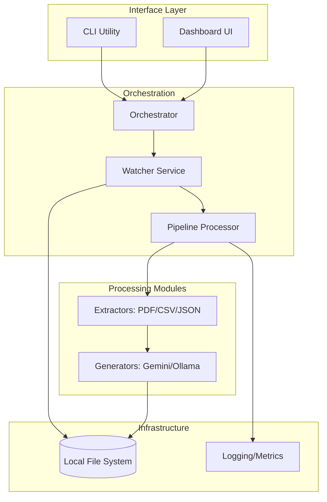
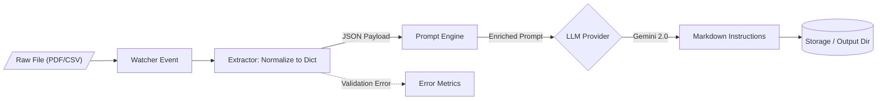

<!--
  Generated by AI-Powered README Generator
  Repository: https://github.com/WomB0ComB0/browser-use
  Generated: 2026-01-30T03:43:40.619Z
  Format: md
  Style: comprehensive
-->

# Enterprise Data Processing Pipeline (Browser-Use)

A modular, production-ready framework for real-time file monitoring and Gemini-powered data extraction to automate instruction generation for AI agents.


## Table of Contents

- [Overview](#overview)
- [Features](#features)
- [Architecture](#architecture)
- [Quick Start](#quick-start)
- [Usage & Examples](#usage--examples)
- [Configuration](#configuration)
- [API Reference](#api-reference)
- [Development](#development)
- [Troubleshooting](#troubleshooting)
- [Contributing](#contributing)
- [Roadmap & Known Issues](#roadmap--known-issues)
- [License & Credits](#license--credits)

## Overview

The **Enterprise Data Processing Pipeline** is an industrial-grade solution designed to bridge the gap between static unstructured data and actionable AI-driven instructions. Modern enterprises manage vast streams of heterogeneous files (CSV, JSON, PDF, Text); this system automates the ingestion, normalization, and contextualization of that data using Google’s Gemini 2.0 Flash models or local LLMs via Ollama.

The system operates as a stateful background service that monitors specific directories, applies format-specific extraction logic, and leverages Large Language Models (LLMs) to transform raw data into structured Markdown guides. By automating the "pre-processing" phase, it ensures that downstream agents have the most relevant, up-to-date context to perform web-based automation.

### Who is this for?
*   **Data Engineers** who need to automate instruction generation for downstream autonomous agents.
*   **AI Automation Teams** building agents that require dynamic context from local file systems.
*   **Enterprise Developers** looking for a robust, async-first file processing skeleton with built-in LLM integration.

## Features

### 📁 Data Ingestion & Extraction
*   ✨ **Real-time Monitoring**: Uses `watchdog` for event-driven processing of new, modified, or moved files.
*   🔄 **Multi-format Support**: Native extractors for `.csv`, `.json`, `.pdf`, `.xlsx`, and `.txt` utilizing `pandas`, `pdfminer`, and `aiofiles`.
*   ⚡ **Async Architecture**: Fully non-blocking I/O using `asyncio` for high-performance concurrent file handling.

### 🤖 AI Instruction Generation
*   🎯 **Gemini 2.0 Native**: Direct integration with Google's latest models for rapid, low-latency instruction generation.
*   🦙 **Ollama Support**: Optional local execution for sensitive data using Ollama-compatible models.
*   🧠 **Contextual Workflows**: Support for YAML-defined workflows (e.g., `code_review.yaml`) to standardize LLM output formats.

### 📊 Operations & Observability
*   🛡️ **Schema Validation**: Powered by `Pydantic` to ensure configuration and data integrity.
*   🌈 **Dashboard**: Built-in Streamlit/Flask dashboard for monitoring pipeline metrics and processing status.
*   🚀 **Structured Logging**: Integrated with `rich` for human-readable terminal output and error tracking.

## Architecture

The system follows a modular "Pipe-and-Filter" architecture where components are loosely coupled via abstract interfaces.

### Core Component Diagram


### Data Flow Transformation


### Tech Stack
| Layer | Technology | Purpose |
| :--- | :--- | :--- |
| **Core Engine** | Python 3.10+, Asyncio | Asynchronous task orchestration |
| **AI / LLM** | Google Gemini 2.0, Ollama | Content generation and NLP |
| **Observation** | Rich, Watchdog | File system events and UI |
| **Data Handling** | Pandas, Pydantic, PDFMiner | Schema validation and parsing |
| **Interface** | Typer, Streamlit | CLI and Monitoring Dashboard |

## Quick Start

### Prerequisites
- Python 3.10 or higher
- A Google Gemini API Key ([Get one here](https://aistudio.google.com/))
- (Optional) Ollama installed for local processing

### Installation

1. **Clone & Setup Environment**
   ```bash
   git clone https://github.com/WomB0ComB0/browser-use.git
   cd browser-use
   python -m venv venv
   source venv/bin/activate  # Windows: venv\Scripts\activate
   pip install -r requirements.txt
   ```

2. **Configure Credentials**
   Create a `.env` file or export directly:
   ```bash
   export GEMINI_API_KEY="your_api_key_here"
   ```

### Minimal "Hello World"
Process a sample file immediately to verify the pipeline:
```bash
python run_pipeline.py process data/sample_users.txt
```

**Expected Output:**
```text
[INFO] Initializing Pipeline Processor...
[INFO] Processing: data/sample_users.txt
✓ Successfully generated: outputs/sample_users_instructions.md
```

## Usage & Examples

### 1. Continuous Watcher Mode
Monitor the `./data` directory. Any new file added will be automatically processed.
```bash
python run_pipeline.py start --config config.yaml --watch
```

### 2. Running with Custom Workflows
Use specific workflow logic (defined in `pipeline/workflows/`) to handle data analysis:
```bash
python run_pipeline.py process data/financials.csv --workflow data_analysis
```

### 3. Programmatic Integration
Use the processor within your own Python application:
```python
import asyncio
from pipeline.processor import PipelineProcessor
from pipeline.config import PipelineConfig

async def main():
    config = PipelineConfig(data_dir="./inputs", output_dir="./results")
    processor = PipelineProcessor(config)
    
    # Process a single file programmatically
    result = await processor.process_file("inputs/orders.csv")
    print(f"Generated instructions at: {result.output_path}")

if __name__ == "__main__":
    asyncio.run(main())
```

### 4. Advanced: Custom Extractor Implementation
<details>
<summary>Click to view implementation steps</summary>

1. Create `pipeline/extractors/xml_extractor.py`:
```python
from pipeline.extractors.base import BaseExtractor

class XmlExtractor(BaseExtractor):
    async def extract(self, file_path: str):
        # Implementation logic
        return {"root": "parsed_data"}
```

2. Register the extension in `pipeline/processor.py`:
```python
self.extractors[".xml"] = XmlExtractor()
```
</details>

## Configuration

The application uses a hierarchy of configuration: Environment Variables > `config.yaml` > CLI Arguments.

### Environment Variables
| Variable | Required | Default | Description |
| :--- | :--- | :--- | :--- |
| `GEMINI_API_KEY` | **Yes** | None | API Key for Google Generative AI |
| `LOG_LEVEL` | No | `INFO` | DEBUG, INFO, WARNING, ERROR |
| `MAX_CONCURRENCY` | No | `5` | Max simultaneous file processing tasks |
| `OLLAMA_BASE_URL` | No | `http://localhost:11434` | Endpoint for local LLM |

### YAML Configuration (`config.yaml`)
```yaml
pipeline:
  input_dir: "./data"
  output_dir: "./outputs"
  supported_extensions: [".csv", ".json", ".pdf", ".txt"]
  
llm:
  provider: "gemini" # or "ollama"
  model: "gemini-2.0-flash"
  temperature: 0.7
  
watcher:
  recursive: true
  ignore_patterns: ["*.tmp", "*.log"]
```

## API Reference

### `PipelineProcessor` (Core)
The primary engine responsible for matching files to extractors and calling generators.

| Method | Parameters | Return | Description |
| :--- | :--- | :--- | :--- |
| `process_file` | `path: str` | `ProcessingResult` | High-level API to run full extraction/generation |
| `get_extractor` | `ext: str` | `BaseExtractor` | Returns the registered extractor for a suffix |
| `shutdown` | `None` | `None` | Gracefully closes all async resources |

### `BaseExtractor` (Abstract)
All extractors must inherit from this and implement the `extract` method.

| Method | Type | Description |
| :--- | :--- | :--- |
| `extract(file_path)` | `async` | Returns a dictionary of normalized content |
| `validate(data)` | `sync` | Optional Pydantic validation of extracted data |

## Development

### Setup for Contributors
1. Install development dependencies:
   ```bash
   pip install -r requirements-dev.txt
   ```
2. Run the test suite:
   ```bash
   pytest tests/
   ```
3. Linting:
   ```bash
   ruff check .
   black .
   ```

### Project Structure
```text
pipeline/
├── extractors/    # Logic for parsing CSV, PDF, etc.
├── generators/    # LLM wrappers (Gemini, Ollama)
├── workflows/     # YAML-based prompt templates
├── dashboard/     # Streamlit monitoring UI
├── orchestrator.py# Main loop and watcher management
└── processor.py   # Atomic processing logic
```

## Troubleshooting

| Error | Cause | Solution |
| :--- | :--- | :--- |
| `403 Forbidden` | Invalid `GEMINI_API_KEY` | Check your environment variables and API quotas. |
| `UnsupportedExtension` | Missing extractor | Add the extension to `config.yaml` or implement a new extractor. |
| `WatchdogTimeout` | OS file handle limit | Increase `ulimit -n` or reduce `MAX_CONCURRENCY`. |
| `Ollama ConnectionRefused` | Service not running | Ensure Ollama server is running via `ollama serve`. |

## Contributing

1. **Fork** the repository.
2. **Create** a feature branch (`git checkout -b feature/amazing-feature`).
3. **Commit** your changes using conventional commits (`feat: add xml support`).
4. **Push** to the branch (`git push origin feature/amazing-feature`).
5. **Open** a Pull Request.

## Roadmap & Known Issues
- [ ] **Roadmap**: Vector database integration for RAG-based instruction generation.
- [ ] **Roadmap**: Built-in cost estimator for Gemini API usage.
- ⚠️ **Issue**: PDF extraction may fail on heavily scanned images without OCR.
- ⚠️ **Issue**: Simultaneous modification of a file might trigger double-processing (use atomic writes).

## License & Credits

- **License**: MIT License. See [LICENSE](LICENSE) for details.
- **Maintainer**: WomB0ComB0
- **Inspiration**: Heavily inspired by the `browser-use` automation ecosystem.