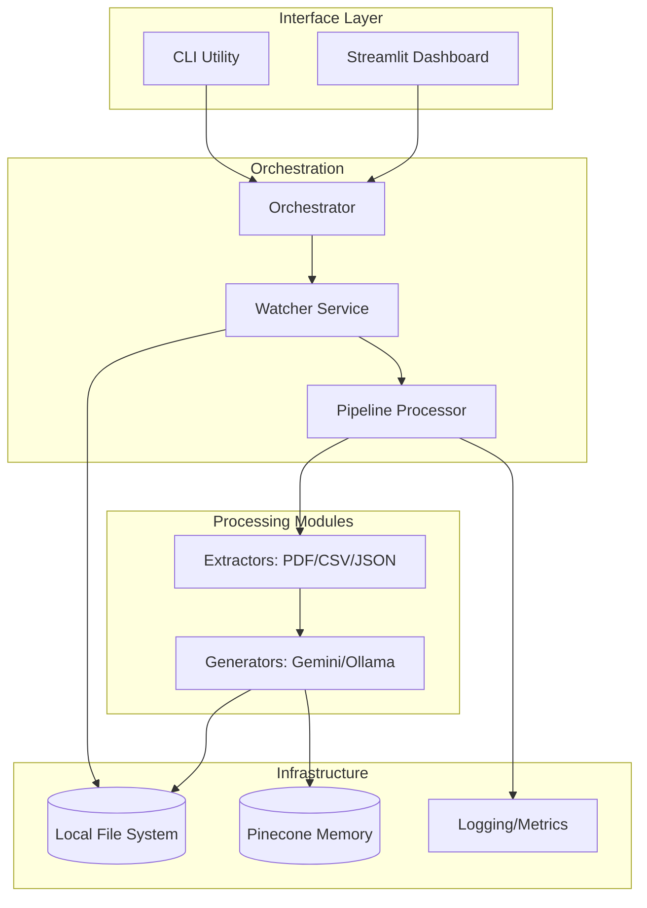
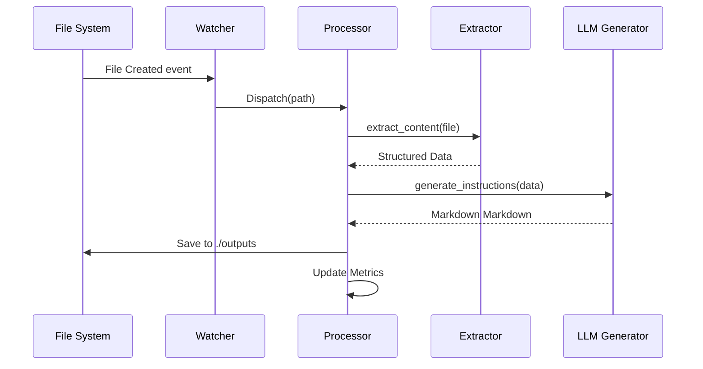
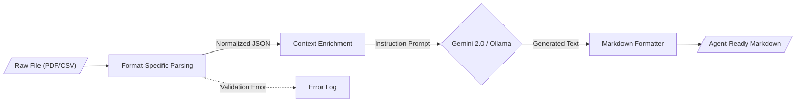

<!--
  Generated by AI-Powered README Generator
  Repository: https://github.com/WomB0ComB0/browser-use
  Generated: 2026-01-30T23:48:53.666Z
  Format: md
  Style: comprehensive
-->

# Enterprise Data Processing Pipeline (Browser-Use)

A modular, production-ready framework for real-time file monitoring and Gemini-powered data extraction designed to automate instruction generation for AI agents.


## Table of Contents

- [Overview](#overview)
- [Features](#features)
- [Architecture](#architecture)
- [Quick Start](#quick-start)
- [Usage & Examples](#usage--examples)
- [Configuration](#configuration)
- [API Reference](#api-reference)
- [Development](#development)
- [Troubleshooting & FAQ](#troubleshooting--faq)
- [Contributing](#contributing)
- [Roadmap & Known Issues](#roadmap--known-issues)
- [License & Credits](#license--credits)

## Overview

The **Enterprise Data Processing Pipeline** (Browser-Use) is an industrial-grade solution designed to bridge the gap between static unstructured data and actionable AI-driven instructions. Modern enterprises manage vast streams of heterogeneous files (CSV, JSON, PDF, Excel); this system automates the ingestion, normalization, and contextualization of that data using Google’s Gemini 2.0 Flash models or local LLMs via Ollama.

The system operates as a stateful background service that monitors specific directories, applies format-specific extraction logic, and leverages Large Language Models (LLMs) to transform raw data into structured Markdown guides. By automating the "pre-processing" phase, it ensures that downstream agents (like Browser-Use agents) have the most relevant, up-to-date context to perform web-based automation tasks.

**Who is this for?**
*   **Data Engineers** who need to automate instruction generation for downstream autonomous agents.
*   **AI Automation Teams** building agents that require dynamic context from local file systems.
*   **Enterprise Developers** looking for a robust, async-first file processing skeleton with built-in LLM integration.

## Features

### 📁 Data Ingestion & Extraction
*   ✨ **Real-time Monitoring**: Uses `watchdog` for event-driven processing of new, modified, or moved files.
*   🔄 **Multi-format Support**: Native extractors for `.csv`, `.json`, `.pdf`, `.xlsx`, and `.txt` utilizing `pandas` and `pdfminer`.
*   ⚡ **Async Architecture**: Fully non-blocking I/O using `asyncio` for high-performance concurrent file handling.
*   🖼️ **OCR Capabilities**: Integrated OCR extractor for processing image-based data sources.

### 🤖 AI Instruction Generation
*   🎯 **Gemini 2.0 Native**: Direct integration with Google's latest models for rapid, low-latency instruction generation.
*   🦙 **Ollama Support**: Optional local execution for sensitive data using Ollama-compatible models.
*   🧠 **Contextual Workflows**: Support for YAML-defined workflows to standardize LLM output formats.
*   💾 **Vector Memory**: Pinecone integration for long-term storage and retrieval of processed context.

### 📊 Operations & Observability
*   🛡️ **Schema Validation**: Powered by `Pydantic` to ensure configuration and data integrity.
*   🌈 **Dashboard**: Built-in FastAPI/Streamlit dashboard for monitoring pipeline metrics and processing status.
*   🚀 **Structured Logging**: Integrated with `rich` for human-readable terminal output and error tracking.

## Architecture

The system follows a modular "Pipe-and-Filter" architecture where components are loosely coupled via abstract interfaces.

### Component Relationship


### Processing Sequence


### Data Flow Transformation


### Tech Stack
| Layer | Technology | Purpose |
| :--- | :--- | :--- |
| **Core Engine** | Python 3.10+, Asyncio | Asynchronous task orchestration |
| **AI / LLM** | Google Gemini 2.0, Ollama | Content generation and NLP |
| **Observation** | Rich, Watchdog | File system events and UI |
| **Data Handling** | Pandas, Pydantic, PDFMiner | Schema validation and parsing |
| **Memory** | Pinecone | Vector storage for context retrieval |

## Quick Start

### Prerequisites
- Python 3.10 or higher
- A Google Gemini API Key ([Get one here](https://aistudio.google.com/))
- (Optional) Ollama installed for local processing

### Installation

1.  **Clone & Setup Environment**
    ```bash
    git clone https://github.com/WomB0ComB0/browser-use.git
    cd browser-use
    python -m venv venv
    source venv/bin/activate  # Windows: venv\Scripts\activate
    pip install -r requirements.txt
    ```

2.  **Configure Credentials**
    Create a `.env` file in the root directory:
    ```bash
    GEMINI_API_KEY="your_api_key_here"
    PINECONE_API_KEY="optional_pinecone_key"
    ```

### Minimal "Hello World"
Process a sample file immediately to verify the pipeline:
```bash
python run_pipeline.py process data/sample_users.txt
```

**Expected Output:**
```text
[INFO] Initializing Pipeline Processor...
[INFO] Processing: data/sample_users.txt
✓ Successfully generated: outputs/sample_users_instructions.md
```

## Usage & Examples

### 1. Continuous Watcher Mode
Monitor the `./data` directory. Any new file added or modified will be automatically processed through the pipeline.
```bash
python run_pipeline.py start --config config.yaml --watch
```

### 2. Running the Monitoring Dashboard
Launch the real-time Streamlit interface to visualize processing metrics, file status, and LLM throughput:
```bash
python run_pipeline.py dashboard
```

### 3. Programmatic Integration
Integrate the processor into your own Python applications for custom automation flows.

```python
import asyncio
from pipeline.processor import PipelineProcessor
from pipeline.config import PipelineConfig

async def main():
    # Initialize configuration
    config = PipelineConfig(
        data_dir="./inputs",
        output_dir="./results",
        model_name="gemini-2.0-flash"
    )
    
    # Initialize processor
    processor = PipelineProcessor(config)
    
    # Run processing
    result = await processor.process_file("inputs/user_data.json")
    
    if result.success:
        print(f"Instructions generated at: {result.output_path}")
    else:
        print(f"Error: {result.error_message}")

if __name__ == "__main__":
    asyncio.run(main())
```

### 4. Advanced: Customizing Workflows
You can define specific behavior for different data types using YAML workflow files in `pipeline/workflows/`.

<details>
<summary>Example: data_analysis.yaml</summary>

```yaml
name: "Data Analysis Workflow"
trigger_extension: ".csv"
prompt_template: |
  Analyze the following data: {extracted_content}
  Generate a step-by-step guide for an AI agent to:
  1. Identify trends
  2. Flag anomalies
  3. Export a summary report
output_format: "markdown"
```
</details>

## Configuration

The system is configured via `config.yaml` and environment variables.

### Environment Variables
| Variable | Required | Default | Description |
| :--- | :--- | :--- | :--- |
| `GEMINI_API_KEY` | Yes* | None | Google AI Studio Key (if using Gemini) |
| `OLLAMA_BASE_URL` | No | `http://localhost:11434` | Endpoint for local LLM |
| `PINECONE_API_KEY`| No | None | API key for vector memory |
| `LOG_LEVEL` | No | `INFO` | Logging verbosity (DEBUG, INFO, etc) |

### Global Config (`config.yaml`)
```yaml
pipeline:
  input_dir: "./data"
  output_dir: "./outputs"
  supported_formats: [".csv", ".json", ".pdf", ".xlsx", ".txt"]
  
model:
  provider: "gemini" # or "ollama"
  name: "gemini-2.0-flash"
  temperature: 0.2
  
memory:
  enabled: true
  index_name: "instruction-cache"
```

## API Reference

### `PipelineProcessor` (Core)
The main engine responsible for handling file events and coordinating extraction/generation.

| Method | Parameters | Returns | Description |
| :--- | :--- | :--- | :--- |
| `process_file` | `path: str` | `ProcessResult` | Performs end-to-end extraction and LLM generation. |
| `batch_process` | `dir: str` | `List[ProcessResult]` | Scans a directory and processes all compatible files. |
| `get_metrics` | None | `Dict` | Returns stats on processing speed and success rates. |

### `BaseExtractor` (Interface)
All file format extractors implement this interface.

| Method | Parameters | Returns | Description |
| :--- | :--- | :--- | :--- |
| `extract` | `file_path: str` | `str \| dict` | Extracts raw text or structured data from file. |
| `validate` | `file_path: str` | `bool` | Checks if the file is readable and correctly formatted. |

## Development

### Setup for Contributors
1. **Clone the repo**
2. **Install development dependencies**:
   ```bash
   pip install -r requirements.txt
   pip install pytest pytest-asyncio black flake8
   ```
3. **Run Tests**:
   ```bash
   pytest tests/
   ```

### Project Structure
```text
├── pipeline/
│   ├── extractors/    # Format-specific logic (PDF, CSV, etc.)
│   ├── generators/    # LLM wrappers (Gemini, Ollama)
│   ├── memory/        # Pinecone/Vector DB integration
│   ├── dashboard/     # Streamlit UI code
│   └── orchestrator.py# Main loop and event handling
├── data/              # Input directory for files
├── outputs/           # Generated Markdown instructions
└── run_pipeline.py    # Main entry point
```

## Troubleshooting & FAQ

### Common Issues
| Error | Cause | Solution |
| :--- | :--- | :--- |
| `API_KEY_INVALID` | Incorrect Gemini Key | Check `.env` and ensure key has Gemini 2.0 access. |
| `Watchdog Limit` | OS file limit reached | Increase `fs.inotify.max_user_watches` on Linux. |
| `OOM Error` | Processing large PDFs | Use the `ocr_extractor` or split the PDF. |

**Q: Can I use this without a GPU?**
A: Yes. If using Gemini, the processing happens on Google's infrastructure. If using Ollama, a GPU is recommended but not required for smaller models.

**Q: How do I add a new file format?**
A: Create a new class in `pipeline/extractors/` that inherits from `BaseExtractor` and register it in `processor.py`.

## Contributing

We welcome contributions! Please follow these steps:
1. Fork the repository.
2. Create a feature branch: `git checkout -b feature/amazing-feature`.
3. Commit your changes: `git commit -m 'Add amazing feature'`.
4. Push to the branch: `git push origin feature/amazing-feature`.
5. Open a Pull Request.

**Commit Convention**: Use [Conventional Commits](https://www.conventionalcommits.org/en/v1.0.0/) (e.g., `feat:`, `fix:`, `docs:`).

## Roadmap & Known Issues

### Roadmap
- [ ] Support for Microsoft Graph/Sharepoint monitoring.
- [ ] Multi-agent collaborative instruction generation.
- [ ] Built-in prompt optimizer based on feedback loops.
- [ ] Support for Anthropic Claude 3.5 models.

### Known Limitations ⚠️
*   **Large Files**: Files over 50MB may hit LLM context window limits; currently, only the first 30k tokens are processed for non-Gemini models.
*   **Excel Macros**: `.xlsm` files with heavy VBA logic may not parse correctly via standard pandas logic.

## License & Credits

**License**: Distributed under the MIT License. See `LICENSE` for more information.

**Credits**:
- [Browser-use](https://github.com/browser-use/browser-use) for the agent inspiration.
- Google Generative AI team for the Gemini API.
- The open-source community for `pandas` and `watchdog`.

**Maintainer**: [WomB0ComB0](https://github.com/WomB0ComB0)