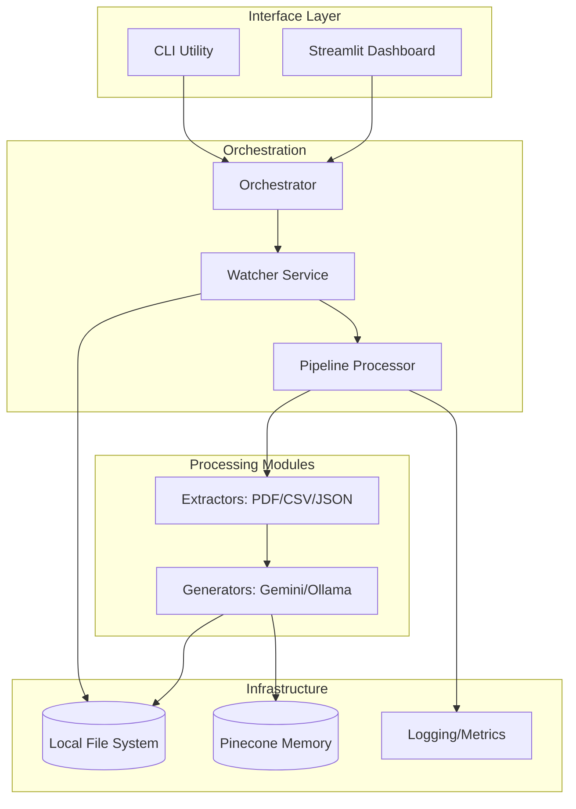
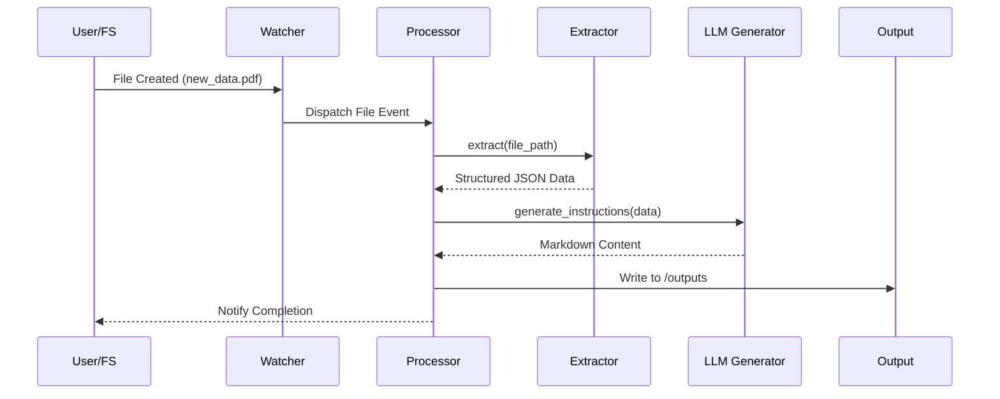
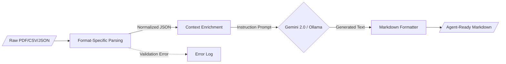

<!--
  Generated by AI-Powered README Generator
  Repository: https://github.com/WomB0ComB0/browser-use
  Generated: 2026-01-30T19:07:09.604Z
  Format: md
  Style: comprehensive
-->

# Enterprise Data Processing Pipeline (Browser-Use)

A modular, production-ready framework for real-time file monitoring and Gemini-powered data extraction to automate instruction generation for AI agents.


## Table of Contents

- [Overview](#overview)
- [Features](#features)
- [Architecture](#architecture)
- [Quick Start](#quick-start)
- [Usage & Examples](#usage--examples)
- [Configuration](#configuration)
- [API Reference](#api-reference)
- [Development](#development)
- [Troubleshooting & FAQ](#troubleshooting--faq)
- [Contributing](#contributing)
- [Roadmap & Known Issues](#roadmap--known-issues)
- [License & Credits](#license--credits)

## Overview

The **Enterprise Data Processing Pipeline** (Browser-Use) is an industrial-grade solution designed to bridge the gap between static unstructured data and actionable AI-driven instructions. Modern enterprises manage vast streams of heterogeneous files (CSV, JSON, PDF, Excel); this system automates the ingestion, normalization, and contextualization of that data using Google’s Gemini 2.0 Flash models or local LLMs via Ollama.

The system operates as a stateful background service that monitors specific directories, applies format-specific extraction logic, and leverages Large Language Models (LLMs) to transform raw data into structured Markdown guides. By automating the "pre-processing" phase, it ensures that downstream agents (like Browser-Use agents) have the most relevant, up-to-date context to perform web-based automation tasks.

**Who is this for?**
*   **Data Engineers** who need to automate instruction generation for downstream autonomous agents.
*   **AI Automation Teams** building agents that require dynamic context from local file systems.
*   **Enterprise Developers** looking for a robust, async-first file processing skeleton with built-in LLM integration.

## Features

### 📁 Data Ingestion & Extraction
*   ✨ **Real-time Monitoring**: Uses `watchdog` for event-driven processing of new, modified, or moved files.
*   🔄 **Multi-format Support**: Native extractors for `.csv`, `.json`, `.pdf`, `.xlsx`, and `.txt` utilizing `pandas` and `pdfminer`.
*   ⚡ **Async Architecture**: Fully non-blocking I/O using `asyncio` for high-performance concurrent file handling.

### 🤖 AI Instruction Generation
*   🎯 **Gemini 2.0 Native**: Direct integration with Google's latest models for rapid, low-latency instruction generation.
*   🦙 **Ollama Support**: Optional local execution for sensitive data using Ollama-compatible models.
*   🧠 **Contextual Workflows**: Support for YAML-defined workflows (e.g., `code_review.yaml`) to standardize LLM output formats.

### 📊 Operations & Observability
*   🛡️ **Schema Validation**: Powered by `Pydantic` to ensure configuration and data integrity.
*   🌈 **Dashboard**: Built-in Streamlit dashboard for monitoring pipeline metrics and processing status.
*   🚀 **Structured Logging**: Integrated with `rich` for human-readable terminal output and error tracking.

## Architecture

The system follows a modular "Pipe-and-Filter" architecture where components are loosely coupled via abstract interfaces.

### System Components


### Request-Response Sequence


### Data Transformation Flow


### Tech Stack
| Layer | Technology | Purpose |
| :--- | :--- | :--- |
| **Core Engine** | Python 3.10+, Asyncio | Asynchronous task orchestration |
| **AI / LLM** | Google Gemini 2.0, Ollama | Content generation and NLP |
| **Observation** | Rich, Watchdog | File system events and UI |
| **Data Handling** | Pandas, Pydantic, PDFMiner | Schema validation and parsing |
| **Interface** | Typer, Streamlit | CLI and Monitoring Dashboard |

## Quick Start

### Prerequisites
- Python 3.10 or higher
- A Google Gemini API Key ([Get one here](https://aistudio.google.com/))
- (Optional) Ollama installed for local processing

### Installation

1.  **Clone & Setup Environment**
    ```bash
    git clone https://github.com/WomB0ComB0/browser-use.git
    cd browser-use
    python -m venv venv
    source venv/bin/activate  # Windows: venv\Scripts\activate
    pip install -r requirements.txt
    ```

2.  **Configure Credentials**
    Create a `.env` file in the root directory:
    ```bash
    GEMINI_API_KEY="your_api_key_here"
    PINECONE_API_KEY="optional_pinecone_key"
    ```

### Minimal "Hello World"
Process a sample file immediately to verify the pipeline:
```bash
python run_pipeline.py process data/sample_users.txt
```

**Expected Output:**
```text
[INFO] Initializing Pipeline Processor...
[INFO] Processing: data/sample_users.txt
✓ Successfully generated: outputs/sample_users_instructions.md
```

## Usage & Examples

### 1. Continuous Watcher Mode
Monitor the `./data` directory. Any new file added will be automatically processed.
```bash
python run_pipeline.py start --config config.yaml --watch
```

### 2. Running the Monitoring Dashboard
Launch the Streamlit interface to visualize processing metrics and logs in real-time:
```bash
streamlit run pipeline/dashboard/app.py
```

### 3. Programmatic Integration
You can import the `PipelineProcessor` into your own application for custom data flows.

```python
import asyncio
from pipeline.processor import PipelineProcessor
from pipeline.config import PipelineConfig

async def main():
    config = PipelineConfig(
        data_dir="./inputs",
        output_dir="./results",
        model_name="gemini-2.0-flash"
    )
    
    processor = PipelineProcessor(config)
    result = await processor.process_file("inputs/user_data.json")
    print(f"Status: {result.status} | Output: {result.output_path}")

if __name__ == "__main__":
    asyncio.run(main())
```

### 4. Custom Extractor Implementation
<details>
<summary>How to add support for a new file format (e.g., XML)</summary>

1.  **Create the Extractor**: Create `pipeline/extractors/xml_extractor.py`.
2.  **Inherit Base**: Extend `BaseExtractor` and implement the `extract()` method.
3.  **Register**: Add the mapping in `pipeline/processor.py`.

```python
from .base import BaseExtractor

class XMLExtractor(BaseExtractor):
    def extract(self, file_path: str) -> dict:
        # Implement XML parsing logic here
        return {"content": "parsed_data"}
```
</details>

## Configuration

### Environment Variables
| Variable | Required | Default | Description |
| :--- | :--- | :--- | :--- |
| `GEMINI_API_KEY` | Yes (for Gemini) | None | Google AI Studio API Key |
| `OLLAMA_BASE_URL` | No | `http://localhost:11434` | Endpoint for local Ollama service |
| `LOG_LEVEL` | No | `INFO` | Logging verbosity (DEBUG, INFO, etc.) |
| `PINECONE_API_KEY`| No | None | Required if using Pinecone memory |

### YAML Configuration (`config.yaml`)
```yaml
pipeline:
  watch_dir: "./data"
  output_dir: "./outputs"
  supported_extensions: [".csv", ".json", ".pdf", ".txt"]
  
llm:
  provider: "gemini" # or "ollama"
  model: "gemini-2.0-flash"
  temperature: 0.7
  
memory:
  enabled: false
  provider: "pinecone"
```

## API Reference

### `PipelineProcessor`
The core engine responsible for routing files to extractors and generators.

| Method | Parameters | Return Type | Description |
| :--- | :--- | :--- | :--- |
| `process_file(path)` | `path: str` | `ProcessingResult` | Orchestrates extraction and generation |
| `get_metrics()` | None | `Dict` | Returns throughput and error rates |

### `BaseExtractor`
Abstract class for all file parsers.

| Method | Parameters | Return Type | Description |
| :--- | :--- | :--- | :--- |
| `extract(path)` | `path: str` | `Dict` | Converts raw file to structured JSON |
| `validate(path)` | `path: str` | `bool` | Checks if file is valid for this extractor |

## Development

### Setup Dev Environment
```bash
# Install development dependencies
pip install -r requirements.txt
pip install pytest pytest-asyncio black flake8

# Run Tests
pytest tests/
```

### Project Structure
```text
pipeline/
├── dashboard/      # Streamlit monitoring UI
├── extractors/     # Format-specific parsing logic (PDF, CSV, etc.)
├── generators/     # LLM integration (Gemini, Ollama)
├── memory/         # Vector DB integrations (Pinecone)
├── orchestrator.py # High-level service management
├── processor.py    # Main task logic
└── watcher.py      # File system event listener
```

### Code Style
- **Linter**: `flake8`
- **Formatter**: `black`
- **Type Checking**: `mypy`

## Troubleshooting & FAQ

**Q: Why are my PDF files failing to process?**
> **A:** Ensure you have `pdfminer.six` installed. Complex scanned PDFs without a text layer may require `ocr_extractor.py` (Tesseract dependency).

**Q: How do I switch to a local model?**
> **A:** Update `config.yaml` to set `llm.provider: "ollama"` and ensure the Ollama service is running on your machine.

**Q: Error: `QUOTA_EXCEEDED` for Gemini.**
> **A:** The free tier of Gemini has rate limits. Consider implementing a retry logic in `pipeline/generators/gemini.py` or upgrading your API plan.

**Common Error Messages:**
| Error | Cause | Solution |
| :--- | :--- | :--- |
| `FileNotFoundError` | Source directory missing | Check `watch_dir` path in `config.yaml` |
| `InvalidAPIKey` | Missing/Wrong Gemini Key | Verify `.env` file contains `GEMINI_API_KEY` |
| `ExtractorNotFound` | Unsupported file type | Add extension to `config.yaml` or create extractor |

## Roadmap & Known Issues

- [x] Gemini 2.0 Flash integration
- [x] Multi-format file extraction (PDF, CSV, JSON)
- [x] Streamlit Monitoring Dashboard
- [ ] [Planned] Integration with Slack/Discord for notifications
- [ ] [Planned] Support for Azure OpenAI as a provider
- [ ] [Planned] Batch processing mode for historical data

⚠️ **Known Limitations**:
- High-resolution images/PDFs require significant memory.
- Large JSON files (>50MB) may exceed LLM context windows; summary-based extraction is recommended for these cases.

## License & Credits

- **License**: Distributed under the MIT License. See `LICENSE` for more information.
- **Maintainer**: [WomB0ComB0](https://github.com/WomB0ComB0)
- **Inspiration**: Built to support advanced workflows for the `browser-use` community.