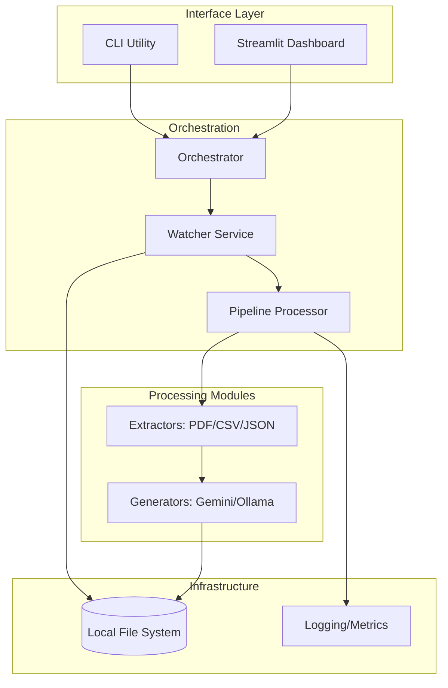
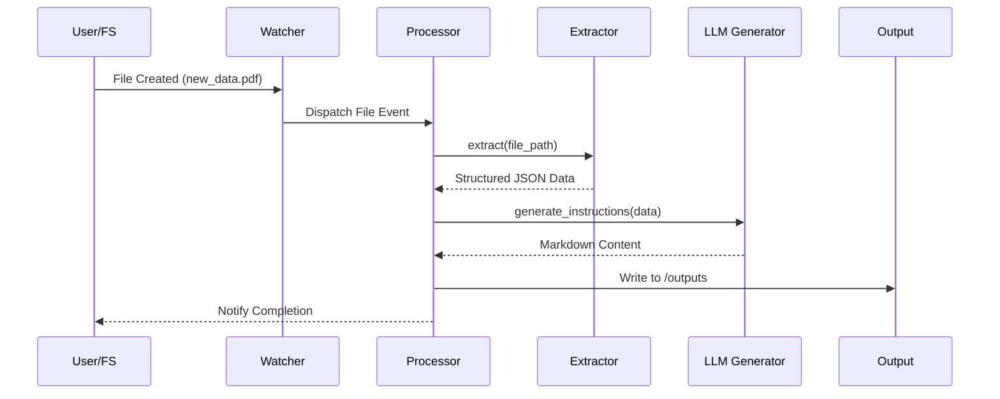
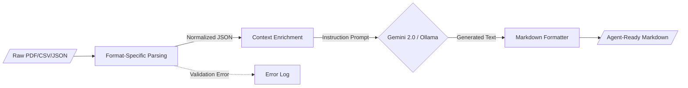

<!--
  Generated by AI-Powered README Generator
  Repository: https://github.com/WomB0ComB0/browser-use
  Generated: 2026-01-30T08:32:09.040Z
  Format: md
  Style: comprehensive
-->

# Enterprise Data Processing Pipeline (Browser-Use)

A modular, production-ready framework for real-time file monitoring and Gemini-powered data extraction to automate instruction generation for AI agents.


## Table of Contents

- [Overview](#overview)
- [Features](#features)
- [Architecture](#architecture)
- [Quick Start](#quick-start)
- [Usage & Examples](#usage--examples)
- [Configuration](#configuration)
- [API Reference](#api-reference)
- [Development](#development)
- [Troubleshooting](#troubleshooting)
- [Contributing](#contributing)
- [Roadmap & Known Issues](#roadmap--known-issues)
- [License & Credits](#license--credits)

## Overview

The **Enterprise Data Processing Pipeline** is an industrial-grade solution designed to bridge the gap between static unstructured data and actionable AI-driven instructions. Modern enterprises manage vast streams of heterogeneous files (CSV, JSON, PDF, Text); this system automates the ingestion, normalization, and contextualization of that data using Google’s Gemini 2.0 Flash models or local LLMs via Ollama.

The system operates as a stateful background service that monitors specific directories, applies format-specific extraction logic, and leverages Large Language Models (LLMs) to transform raw data into structured Markdown guides. By automating the "pre-processing" phase, it ensures that downstream agents have the most relevant, up-to-date context to perform web-based automation.

**Who is this for?**
*   **Data Engineers** who need to automate instruction generation for downstream autonomous agents.
*   **AI Automation Teams** building agents that require dynamic context from local file systems.
*   **Enterprise Developers** looking for a robust, async-first file processing skeleton with built-in LLM integration.

## Features

### 📁 Data Ingestion & Extraction
*   ✨ **Real-time Monitoring**: Uses `watchdog` for event-driven processing of new, modified, or moved files.
*   🔄 **Multi-format Support**: Native extractors for `.csv`, `.json`, `.pdf`, `.xlsx`, and `.txt` utilizing `pandas` and `pdfminer`.
*   ⚡ **Async Architecture**: Fully non-blocking I/O using `asyncio` for high-performance concurrent file handling.

### 🤖 AI Instruction Generation
*   🎯 **Gemini 2.0 Native**: Direct integration with Google's latest models for rapid, low-latency instruction generation.
*   🦙 **Ollama Support**: Optional local execution for sensitive data using Ollama-compatible models.
*   🧠 **Contextual Workflows**: Support for YAML-defined workflows (e.g., `code_review.yaml`) to standardize LLM output formats.

### 📊 Operations & Observability
*   🛡️ **Schema Validation**: Powered by `Pydantic` to ensure configuration and data integrity.
*   🌈 **Dashboard**: Built-in Streamlit dashboard for monitoring pipeline metrics and processing status.
*   🚀 **Structured Logging**: Integrated with `rich` for human-readable terminal output and error tracking.

## Architecture

The system follows a modular "Pipe-and-Filter" architecture where components are loosely coupled via abstract interfaces.

### System Components


### Request-Response Sequence


### Data Transformation Flow


### Tech Stack
| Layer | Technology | Purpose |
| :--- | :--- | :--- |
| **Core Engine** | Python 3.10+, Asyncio | Asynchronous task orchestration |
| **AI / LLM** | Google Gemini 2.0, Ollama | Content generation and NLP |
| **Observation** | Rich, Watchdog | File system events and UI |
| **Data Handling** | Pandas, Pydantic, PDFMiner | Schema validation and parsing |
| **Interface** | Typer, Streamlit | CLI and Monitoring Dashboard |

## Quick Start

### Prerequisites
- Python 3.10 or higher
- A Google Gemini API Key ([Get one here](https://aistudio.google.com/))
- (Optional) Ollama installed for local processing

### Installation

1.  **Clone & Setup Environment**
    ```bash
    git clone https://github.com/WomB0ComB0/browser-use.git
    cd browser-use
    python -m venv venv
    source venv/bin/activate  # Windows: venv\Scripts\activate
    pip install -r requirements.txt
    ```

2.  **Configure Credentials**
    Create a `.env` file in the root directory:
    ```bash
    GEMINI_API_KEY="your_api_key_here"
    ```

### Minimal "Hello World"
Process a sample file immediately to verify the pipeline:
```bash
python run_pipeline.py process data/sample_users.txt
```

**Expected Output:**
```text
[INFO] Initializing Pipeline Processor...
[INFO] Processing: data/sample_users.txt
✓ Successfully generated: outputs/sample_users_instructions.md
```

## Usage & Examples

### 1. Continuous Watcher Mode
Monitor the `./data` directory. Any new file added will be automatically processed.
```bash
python run_pipeline.py start --config config.yaml --watch
```

### 2. Running the Monitoring Dashboard
Launch the Streamlit interface to visualize processing metrics and logs in real-time:
```bash
streamlit run pipeline/dashboard/app.py
```

### 3. Programmatic Integration
You can import the `PipelineProcessor` into your own application for custom data flows.

```python
import asyncio
from pipeline.processor import PipelineProcessor
from pipeline.config import PipelineConfig

async def main():
    # Define configuration
    config = PipelineConfig(
        data_dir="./inputs",
        output_dir="./results",
        model_name="gemini-2.0-flash"
    )
    
    processor = PipelineProcessor(config)
    
    # Process a single file programmatically
    result = await processor.process_file("inputs/user_data.json")
    print(f"Status: {result.status}")
    print(f"Output Location: {result.output_path}")

if __name__ == "__main__":
    asyncio.run(main())
```

### 4. Advanced: Custom Extractor Implementation
<details>
<summary>How to add support for a new file format (e.g., XML)</summary>

1.  **Create the Extractor**: Create `pipeline/extractors/xml_extractor.py` inheriting from `BaseExtractor`.
    ```python
    from pipeline.extractors.base import BaseExtractor

    class XmlExtractor(BaseExtractor):
        async def extract(self, file_path: str) -> dict:
            # Add logic to parse XML to dictionary
            return {"data": "parsed_content"}
    ```

2.  **Register the Extractor**: In `pipeline/processor.py`, add the mapping:
    ```python
    self.extractors[".xml"] = XmlExtractor()
    ```
</details>

## Configuration

The application uses a hierarchy of configuration: Environment Variables > `config.yaml` > CLI Arguments.

### Environment Variables
| Variable | Required | Default | Description |
| :--- | :--- | :--- | :--- |
| `GEMINI_API_KEY` | **Yes** | None | API Key for Google Gemini services |
| `OLLAMA_BASE_URL` | No | `http://localhost:11434` | Endpoint for local Ollama instance |
| `LOG_LEVEL` | No | `INFO` | Logging verbosity (DEBUG, INFO, ERROR) |

### Configuration File (`config.yaml`)
```yaml
pipeline:
  data_dir: "./data"
  output_dir: "./outputs"
  watch_interval: 1.0

llm:
  provider: "gemini" # or "ollama"
  model: "gemini-2.0-flash"
  temperature: 0.7

extractors:
  pdf_enabled: true
  max_file_size_mb: 25
```

## API Reference

### `PipelineProcessor`
The primary class managing the lifecycle of file extraction and LLM generation.

| Method | Parameters | Return Type | Description |
| :--- | :--- | :--- | :--- |
| `process_file` | `path: str` | `ProcessingResult` | Extracts data and generates instructions for a file |
| `get_metrics` | None | `dict` | Returns counts of success/failure and latency |
| `shutdown` | None | `None` | Cleans up extractor resources and async loops |

### `ExtractorBase`
All format-specific extractors implement this interface.

*   `extract(file_path: str) -> dict`: Returns a normalized dictionary of the file's content.
*   `validate(file_path: str) -> bool`: Checks if the file is readable and matches the expected schema.

## Development

### Setup for Contributors
```bash
# Install development dependencies
pip install -r requirements-dev.txt

# Run linters
flake8 pipeline/
black pipeline/

# Run tests
pytest tests/ --cov=pipeline
```

### Project Structure
*   `pipeline/orchestrator.py`: Entry point for managing the Watcher and Processor.
*   `pipeline/extractors/`: Individual logic for PDF, Excel, CSV parsing.
*   `pipeline/generators/`: LLM client wrappers (Gemini, Ollama).
*   `pipeline/workflows/`: YAML templates for specific AI personas.

## Troubleshooting

| Error Message | Cause | Solution |
| :--- | :--- | :--- |
| `API_KEY_INVALID` | Incorrect Gemini Key | Check `.env` file and permissions in AI Studio |
| `ModuleNotFoundError: pdfminer` | Missing dependency | Run `pip install pdfminer.six` |
| `Watcher Permission Denied` | OS locked directory | Ensure the `data_dir` has read/write permissions |
| `Ollama Connection Refused` | Ollama not running | Start the Ollama service: `ollama serve` |

## Performance Considerations
*   **Concurrency**: The pipeline uses a semaphore to limit concurrent LLM calls (default: 5) to prevent rate-limiting.
*   **Memory Usage**: For massive CSVs, the `CsvExtractor` uses `pandas` chunking to keep memory overhead low.
*   **PDF Processing**: Large PDFs (>50 pages) may experience latency during text extraction; consider using the `subset` parameter in config.

## Roadmap & Known Issues
- [x] Gemini 2.0 Flash integration
- [x] Real-time file system watching
- [ ] Support for OCR on scanned PDFs
- [ ] Integration with Pinecone for long-term memory/RAG
- [ ] Webhook notifications on processing completion

⚠️ **Known Issue**: Moving a file into the watched directory and immediately deleting it can occasionally cause a race condition in the `watchdog` event loop.

## License & Credits

Distributed under the **MIT License**. See `LICENSE` for more information.

**Credits:**
- Built using [browser-use](https://github.com/browser-use/browser-use) as a foundational inspiration.
- PDF extraction powered by `pdfminer.six`.
- LLM capabilities provided by Google Generative AI.