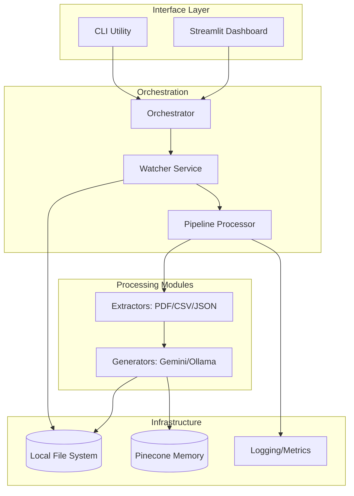
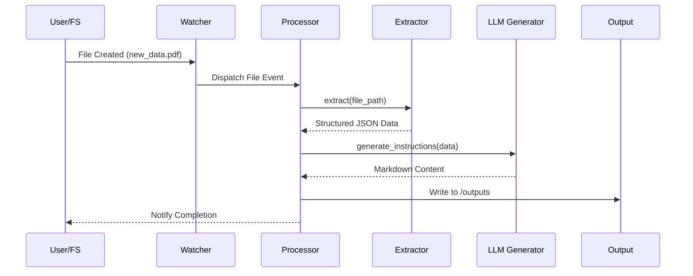
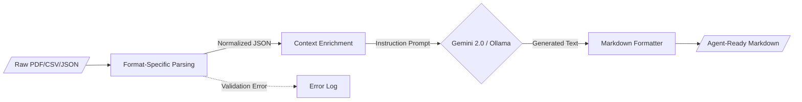

<!--
  Generated by AI-Powered README Generator
  Repository: https://github.com/WomB0ComB0/browser-use
  Generated: 2026-01-30T19:55:36.467Z
  Format: md
  Style: comprehensive
-->

# Enterprise Data Processing Pipeline (Browser-Use)

A modular, production-ready framework for real-time file monitoring and Gemini-powered data extraction
designed to automate instruction generation for AI agents.


## Table of Contents

- [Overview](#overview)
- [Features](#features)
- [Architecture](#architecture)
- [Quick Start](#quick-start)
- [Usage & Examples](#usage--examples)
- [Configuration](#configuration)
- [API Reference](#api-reference)
- [Development](#development)
- [Troubleshooting & FAQ](#troubleshooting--faq)
- [Contributing](#contributing)
- [Roadmap & Known Issues](#roadmap--known-issues)
- [License & Credits](#license--credits)

## Overview

The **Enterprise Data Processing Pipeline** (Browser-Use) is an industrial-grade solution designed to
bridge the gap between static unstructured data and actionable AI-driven instructions. Modern
enterprises manage vast streams of heterogeneous files (CSV, JSON, PDF, Excel); this system
automates the ingestion, normalization, and contextualization of that data using Google’s Gemini 2.0
Flash models or local LLMs via Ollama.

The system operates as a stateful background service that monitors specific directories, applies
format-specific extraction logic, and leverages Large Language Models (LLMs) to transform raw data
into structured Markdown guides. By automating the "pre-processing" phase, it ensures that
downstream agents (like Browser-Use agents) have the most relevant, up-to-date context to perform
web-based automation tasks.

**Who is this for?**
*   **Data Engineers** who need to automate instruction generation for downstream autonomous agents.
*   **AI Automation Teams** building agents that require dynamic context from local file systems.
*   **Enterprise Developers** looking for a robust, async-first file processing skeleton with
    built-in LLM integration.

## Features

### 📁 Data Ingestion & Extraction
*   ✨ **Real-time Monitoring**: Uses `watchdog` for event-driven processing of new, modified, or
    moved files.
*   🔄 **Multi-format Support**: Native extractors for `.csv`, `.json`, `.pdf`, `.xlsx`, and `.txt`
    utilizing `pandas` and `pdfminer`.
*   ⚡ **Async Architecture**: Fully non-blocking I/O using `asyncio` for high-performance
    concurrent file handling.

### 🤖 AI Instruction Generation
*   🎯 **Gemini 2.0 Native**: Direct integration with Google's latest models for rapid, low-latency
    instruction generation.
*   🦙 **Ollama Support**: Optional local execution for sensitive data using Ollama-compatible
    models.
*   🧠 **Contextual Workflows**: Support for YAML-defined workflows to standardize LLM output
    formats.

### 📊 Operations & Observability
*   🛡️ **Schema Validation**: Powered by `Pydantic` to ensure configuration and data integrity.
*   🌈 **Dashboard**: Built-in FastAPI/WebSocket dashboard for monitoring pipeline metrics and processing
    status.
*   🚀 **Structured Logging**: Integrated with `rich` for human-readable terminal output and error
    tracking.

## Architecture

The system follows a modular "Pipe-and-Filter" architecture where components are loosely coupled via
abstract interfaces.

### System Components


### Request-Response Sequence


### Data Transformation Flow


### Tech Stack
| Layer | Technology | Purpose |
| :--- | :--- | :--- |
| **Core Engine** | Python 3.10+, Asyncio | Asynchronous task orchestration |
| **AI / LLM** | Google Gemini 2.0, Ollama | Content generation and NLP |
| **Observation** | Rich, Watchdog | File system events and UI |
| **Data Handling** | Pandas, Pydantic, PDFMiner | Schema validation and parsing |
| **Interface** | Typer, Streamlit | CLI and Monitoring Dashboard |

## Quick Start

### Prerequisites
- Python 3.10 or higher
- A Google Gemini API Key ([Get one here](https://aistudio.google.com/))
- (Optional) Ollama installed for local processing

### Installation

1.  **Clone & Setup Environment**
    ```bash
    git clone https://github.com/WomB0ComB0/browser-use.git
    cd browser-use
    python -m venv venv
    source venv/bin/activate  # Windows: venv\Scripts\activate
    pip install -r requirements.txt
    ```

2.  **Configure Credentials**
    Create a `.env` file in the root directory:
    ```bash
    GEMINI_API_KEY="your_api_key_here"
    PINECONE_API_KEY="optional_pinecone_key"
    ```

### Minimal "Hello World"
Process a sample file immediately to verify the pipeline:
```bash
python run_pipeline.py process data/sample_users.txt
```

**Expected Output:**
```text
[INFO] Initializing Pipeline Processor...
[INFO] Processing: data/sample_users.txt
✓ Successfully generated: outputs/sample_users_instructions.md
```

## Usage & Examples

### 1. Continuous Watcher Mode
Monitor the `./data` directory. Any new file added will be automatically processed.
```bash
python run_pipeline.py start --config config.yaml --watch
```

### 2. Running the Monitoring Dashboard
Launch the real-time interface to visualize processing metrics and logs:
```bash
python run_pipeline.py dashboard
```

### 3. Programmatic Integration
You can import the `PipelineProcessor` into your own application for custom data flows.

```python
import asyncio
from pipeline.processor import PipelineProcessor
from pipeline.config import PipelineConfig

async def main():
    config = PipelineConfig(
        data_dir="./inputs",
        output_dir="./results",
        model_name="gemini-2.0-flash"
    )
    
    processor = PipelineProcessor(config)
    result = await processor.process_file("inputs/user_data.json")
    print(f"Status: {result.status} | Output: {result.output_path}")

if __name__ == "__main__":
    asyncio.run(main())
```

### 4. Custom Extractor Implementation
<details>
<summary>How to add support for a new file format (e.g., XML)</summary>

To add a new extractor, inherit from `BaseExtractor` in `pipeline/extractors/base.py`:

```python
from pipeline.extractors.base import BaseExtractor

class XmlExtractor(BaseExtractor):
    def extract(self, file_path: str):
        # Implementation logic here
        return {"data": "extracted_xml_content"}
```
Then, register it in the `Processor` mapping.
</details>

## Configuration

The system is configured via `config.yaml` and environment variables.

### Environment Variables (`.env`)
| Variable | Required | Default | Description |
| :--- | :--- | :--- | :--- |
| `GEMINI_API_KEY` | Yes | N/A | API Key for Google Gemini 2.0 |
| `PINECONE_API_KEY`| No | N/A | API Key for Pinecone vector storage |
| `OLLAMA_BASE_URL` | No | `http://localhost:11434` | Endpoint for local LLM |

### Config Schema (`config.yaml`)
```yaml
directories:
  data: "data"
  output: "output"
  logs: "logs"

processing:
  supported_extensions: [".pdf", ".csv", ".json", ".xlsx", ".txt"]
  concurrent_workers: 4

generator:
  provider: "gemini" # or "ollama"
  model: "auto"
  temperature: 0.7

watcher:
  recursive: true
  ignore_patterns: ["*.tmp", ".*"]
```

## API Reference

### `Orchestrator`
The high-level manager for complex multi-agent workflows.

| Method | Parameters | Returns | Description |
| :--- | :--- | :--- | :--- |
| `execute_workflow()` | `workflow, content` | `WorkflowResult` | Runs a multi-step agent workflow. |
| `execute_parallel_steps()` | `steps, context` | `dict` | Runs multiple agents in parallel. |
| `create_code_review_workflow()` | None | `WorkflowConfig` | Pre-defined code review workflow. |

### `PipelineProcessor`
Handles the logic of routing files to extractors and generators.

| Method | Parameters | Returns | Description |
| :--- | :--- | :--- | :--- |
| `process_file()` | `path: str` | `ProcessingResult` | The core extraction/generation loop. |
| `get_metrics()` | None | `dict` | Returns throughput and error rates. |

## Development

### Setup for Contributors
1. Clone the repo and install dev dependencies:
   ```bash
   pip install -r requirements.txt
   pip install pytest pytest-asyncio black flake8
   ```
2. Run the test suite:
   ```bash
   pytest tests/test_integration.py
   ```

### Project Structure
*   `pipeline/orchestrator.py`: Main service management.
*   `pipeline/extractors/`: Individual parsers for file types.
*   `pipeline/generators/`: LLM wrappers (Gemini/Ollama).
*   `pipeline/dashboard/`: Streamlit monitoring app.
*   `data/`: Default input directory.

## Troubleshooting & FAQ

**Q: My PDF isn't being parsed correctly.**
> **Solution:** Ensure the PDF is not an image-only scan. If it is, the system automatically 
> triggers the `OCRExtractor` which uses `EasyOCR`. No external dependencies like Tesseract are required.

**Q: Connection error with Ollama.**
> **Solution:** Verify the Ollama service is running locally (`ollama serve`) and the
> `OLLAMA_BASE_URL` in your `.env` matches your local setup.

**Common Error Messages:**
*   `AuthenticationError`: Check your `GEMINI_API_KEY`.
*   `UnsupportedFileError`: The file extension is not in the `supported_extensions` list in
    `config.yaml`.

## Roadmap & Known Issues

- [x] Gemini 2.0 Flash Integration
- [x] Real-time folder watching
- [ ] [Planned] Support for Google Drive/S3 ingestion
- [ ] [Planned] Multi-modal support (Images to instructions)
- [ ] [Planned] Feedback loop for agent correction

**⚠️ Known Limitations:**
*   Excel extraction (`.xlsx`) requires the `openpyxl` engine.
*   Concurrent file processing is limited by LLM API rate limits.

## License & Credits

Distributed under the **MIT License**. See `LICENSE` for more information.

**Credits:**
*   [Browser-Use](https://github.com/browser-use/browser-use) for the agent inspiration.
*   [Google AI](https://aistudio.google.com/) for the Gemini 2.0 API.
*   [Watchdog](https://github.com/gorakhargosh/python-watchdog) for file system events.

**Maintainer:** [WomB0ComB0](https://github.com/WomB0ComB0)