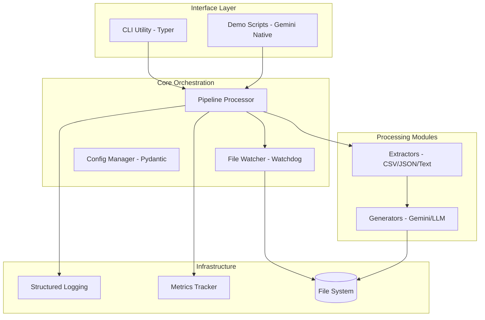
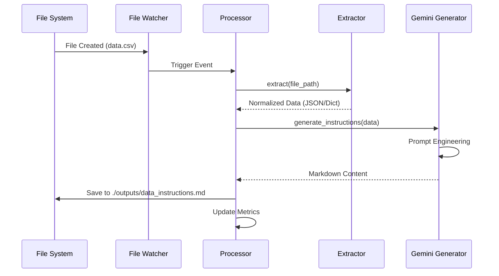

<!--
  Generated by AI-Powered README Generator
  Repository: https://github.com/WomB0ComB0/browser-use
  Generated: 2026-01-30T02:05:37.517Z
  Format: md
  Style: comprehensive
-->

# Enterprise Data Processing Pipeline (Browser-Use)

A modular, production-ready framework for real-time file monitoring and Gemini-powered data extraction to automate instruction generation for AI agents.


## Table of Contents

- [Overview](#overview)
- [Features](#features)
- [Architecture](#architecture)
- [Quick Start](#quick-start)
- [Usage & Examples](#usage--examples)
- [Configuration](#configuration)
- [API Reference](#api-reference)
- [Development](#development)
- [Troubleshooting](#troubleshooting)
- [Contributing](#contributing)
- [Roadmap & Known Issues](#roadmap--known-issues)
- [License & Credits](#license--credits)

## Overview

The **Enterprise Data Processing Pipeline** (integrated with `browser-use`) is an industrial-grade solution designed to bridge the gap between static unstructured data and actionable AI-driven instructions. Modern enterprises manage vast streams of heterogeneous files (CSV, JSON, Text); this system automates the ingestion, normalization, and contextualization of that data using Google’s Gemini 2.0 Flash models.

The system operates as a stateful background service that monitors specific directories, applies format-specific extraction logic, and leverages Large Language Models (LLMs) to transform raw data into structured Markdown guides or operational tasks. By automating the "pre-processing" phase, it ensures that downstream browser-use agents have the most relevant, up-to-date context to perform web-based automation.

### Who is this for?
*   **Data Engineers** who need to automate instruction generation for downstream autonomous agents.
*   **AI Automation Teams** building "browser-use" agents that require dynamic context from local file systems.
*   **Enterprise Developers** looking for a robust, async-first file processing skeleton with built-in LLM integration.

## Features

### 📁 Data Ingestion
*   ✨ **Real-time Monitoring**: Uses `watchdog` for event-driven processing of new, modified, or moved files.
*   🔄 **Multi-format Support**: Native extractors for `.txt`, `.md`, `.json`, and `.csv` utilizing `pandas` and `aiofiles`.
*   ⚡ **Async Architecture**: Fully non-blocking I/O using `asyncio` for high-performance concurrent file handling.

### 🤖 AI Integration
*   🎯 **Gemini 2.0 Native**: Direct integration with Google's `gemini-2.0-flash` for rapid, low-latency instruction generation.
*   🧠 **Contextual Processing**: Automatically converts raw database exports (CSV/JSON) into natural language instructions for browser agents.
*   🛠️ **Extensible Generators**: Abstract base classes allow for swapping Gemini with OpenAI, Anthropic, or local LLMs.

### 📊 Operations & DX
*   🛡️ **Schema Validation**: Powered by `Pydantic` to ensure configuration and data integrity.
*   🌈 **Structured Logging**: Integrated with `rich` for beautiful, human-readable terminal output and error tracking.
*   🚀 **CLI Utility**: A comprehensive command-line interface built with `typer` for easy deployment and manual overrides.

## Architecture

The system follows a modular "Pipe-and-Filter" architecture where components are loosely coupled via abstract interfaces.

### Component Relationship


### Data Flow Sequence


### Tech Stack
| Layer | Technology | Purpose |
| :--- | :--- | :--- |
| **Core Engine** | Python 3.10+, Asyncio | Asynchronous task orchestration |
| **AI / LLM** | LangChain, Google Gemini 2.0 | Content generation and NLP |
| **Observation** | Rich, Watchdog | File system events and UI |
| **Data Handling** | Pandas, Pydantic | Schema validation and parsing |
| **CLI** | Typer | Command-line argument parsing |

## Quick Start

### Prerequisites
- Python 3.10 or higher
- A Google Gemini API Key ([Get one here](https://aistudio.google.com/))
- Git

### Installation

1. **Clone & Setup Environment**
   ```bash
   git clone https://github.com/WomB0ComB0/browser-use.git
   cd browser-use
   python -m venv venv
   source venv/bin/activate  # Windows: venv\Scripts\activate
   pip install -r requirements.txt
   ```

2. **Configure Credentials**
   ```bash
   export GEMINI_API_KEY="your_api_key_here"
   ```

### Minimal "Hello World"
Process a sample file immediately to verify the pipeline:
```bash
python run_pipeline.py process data/sample_users.txt
```

**Expected Output:**
```text
[INFO] Initializing Pipeline Processor...
[INFO] Processing: data/sample_users.txt
✓ Successfully generated: outputs/sample_users_instructions.md
```

## Usage & Examples

### 1. Continuous Watcher Mode
Monitor the `./data` directory. Any new file added will be automatically processed.
```bash
python run_pipeline.py start --config config.yaml --watch
```

### 2. Programmatic Integration
Use the processor within your own Python application:
```python
import asyncio
from pipeline.processor import PipelineProcessor
from pipeline.config import PipelineConfig

async def main():
    config = PipelineConfig(data_dir="./inputs", output_dir="./results")
    processor = PipelineProcessor(config)
    
    # Process a single file
    await processor.process_file("inputs/orders.csv")

if __name__ == "__main__":
    asyncio.run(main())
```

### 3. Custom Extractor Implementation
<details>
<summary>View Example: Adding XML Support</summary>

1. Create `pipeline/extractors/xml_extractor.py`:
```python
from pipeline.extractors.base import BaseExtractor

class XmlExtractor(BaseExtractor):
    async def extract(self, file_path: str):
        # Your XML parsing logic here
        return {"root": "data"}
```

2. Register in `pipeline/processor.py`:
```python
self.extractors[".xml"] = XmlExtractor()
```
</details>

## Configuration

The application uses a hierarchy of configuration: Environment Variables > `config.yaml` > CLI Arguments.

### Environment Variables
| Variable | Required | Default | Description |
| :--- | :--- | :--- | :--- |
| `GEMINI_API_KEY` | **Yes** | None | API Key for Google Generative AI |
| `LOG_LEVEL` | No | `INFO` | DEBUG, INFO, WARNING, ERROR |
| `MAX_CONCURRENCY` | No | `5` | Max simultaneous file processing tasks |

### Configuration File (`config.yaml`)
```yaml
directories:
  input: "./data"
  output: "./outputs"
  logs: "./logs"

gemini:
  model: "gemini-2.0-flash"
  temperature: 0.7
  max_output_tokens: 2048

pipeline:
  supported_extensions: [".csv", ".json", ".txt"]
  delete_after_processing: false
```

## API Reference

### `PipelineProcessor` (Core)
| Method | Params | Description |
| :--- | :--- | :--- |
| `initialize()` | None | Prepares output directories and validates API keys. |
| `process_file(path)` | `str` | Runs the full extraction -> generation flow for one file. |
| `start_watcher()` | None | Begins non-blocking OS directory monitoring. |

### `BaseExtractor` (Interface)
| Method | Returns | Description |
| :--- | :--- | :--- |
| `extract(file_path)` | `Dict[str, Any]` | Abstract method to parse file into a dictionary. |
| `validate(data)` | `bool` | Optional check to ensure data meets LLM prompt requirements. |

## Development

### Setup for Contributors
```bash
# Install dev dependencies
pip install -e ".[dev]"

# Run tests
pytest tests/

# Run linter
ruff check .
```

### Project Structure
- `pipeline/`: Core logic
    - `extractors/`: File-specific parsing logic (CSV, JSON, etc.)
    - `generators/`: LLM interface (Gemini implementation)
    - `utils/`: Logging, metrics, and helper functions
- `data/`: Default input directory for processing
- `run_pipeline.py`: Main CLI entry point

## Troubleshooting

| Error Message | Cause | Solution |
| :--- | :--- | :--- |
| `401 Unauthorized` | Invalid `GEMINI_API_KEY` | Ensure the key is exported in your environment. |
| `Unsupported extension` | File type not registered | Add the extension to `config.yaml` and implement an extractor. |
| `FileNotFoundError` | Input directory missing | Create the directory defined in `config.yaml`. |
| `RateLimitError` | Too many Gemini API calls | Increase `concurrency_limit` in config to slow down processing. |

## Roadmap & Known Issues

### Roadmap
- [ ] Support for `.xlsx` and `.pdf` extraction.
- [ ] Integration with local LLMs via Ollama.
- [ ] Webhook notifications on processing completion.
- [ ] Multi-agent workflow orchestration using `browser-use` native agents.

### Known Limitations
- ⚠️ **CSV Size**: Very large CSV files (>100MB) may consume significant memory during Pandas extraction.
- ⚠️ **Rate Limits**: Google Gemini 2.0 Flash has specific RPM (Requests Per Minute) limits on free tiers.

## License & Credits

### License
Distributed under the **MIT License**. See `LICENSE` for more information.

### Credits
- [browser-use](https://github.com/browser-use/browser-use) for the agent foundation.
- [Google Generative AI](https://ai.google.dev/) for the Gemini 2.0 model.
- [Watchdog](https://github.com/gorakhargosh/watchdog) for file system events.

---
**Maintainer:** [WomB0ComB0](https://github.com/WomB0ComB0)