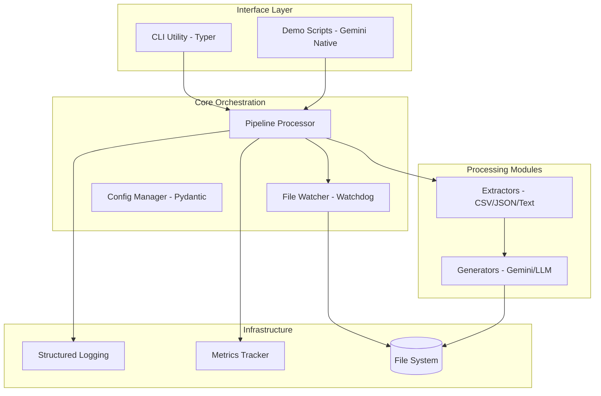
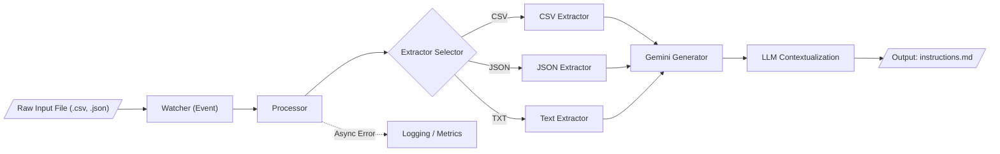

<!--
  Generated by AI-Powered README Generator
  Repository: https://github.com/WomB0ComB0/browser-use
  Generated: 2026-01-30T01:57:58.554Z
  Format: md
  Style: comprehensive
-->

# Enterprise Data Processing Pipeline (Browser-Use)

A modular, production-ready framework for real-time file monitoring and Gemini-powered data extraction and instruction generation.


## Table of Contents

- [Overview](#overview)
- [Features](#features)
- [Architecture](#architecture)
- [Quick Start](#quick-start)
- [Usage & Examples](#usage--examples)
- [Configuration](#configuration)
- [API Reference](#api-reference)
- [Development](#development)
- [Troubleshooting](#troubleshooting)
- [Contributing](#contributing)
- [Roadmap & Known Issues](#roadmap--known-issues)
- [License & Credits](#license--credits)

## Overview

The **Enterprise Data Processing Pipeline** (integrated with `browser-use`) is designed to bridge the gap between static unstructured data and actionable AI-driven instructions. Modern enterprises handle massive streams of heterogeneous files (CSV, JSON, Text); this system automates the ingestion, normalization, and generation of contextual instructions using Google’s Gemini 2.0 Flash models.

The system operates as a stateful service that monitors specific directories, applies format-specific extraction logic, and uses Large Language Models (LLMs) to transform raw data into structured Markdown guides or operational tasks.

### Who is this for?
*   **Data Engineers** looking to automate instruction generation for downstream agents.
*   **AI Automation Teams** building "browser-use" agents that require dynamic context from local files.
*   **Enterprise Developers** needing a robust, async-first file processing skeleton.

## Features

*   📁 **Real-time File Watching**: Leverages `watchdog` for event-driven processing of new and modified files.
*   🔄 **Multi-format Support**: Built-in extractors for `.txt`, `.md`, `.json`, and `.csv` files using `pandas` and `aiofiles`.
*   🤖 **Gemini AI Integration**: Native support for `gemini-2.0-flash` to generate high-quality instructions based on data context.
*   📊 **Structured Logging & Metrics**: Integrated with `rich` for beautiful terminal output and internal metrics tracking.
*   ⚡ **Async Architecture**: Fully non-blocking I/O using `asyncio` for high-performance concurrent file handling.
*   🎯 **CLI First**: Powerful command-line interface built with `typer` for easy automation and manual overrides.

## Architecture

The system follows a modular "Pipe-and-Filter" architecture where the `PipelineProcessor` acts as the central orchestrator.

### Component Relationship


### Data Flow


### Tech Stack
| Layer | Technology | Purpose |
| :--- | :--- | :--- |
| **Core Engine** | Python 3.10+, Asyncio | Asynchronous task orchestration |
| **Data Extraction** | Pandas, Pydantic | Schema validation and tabular data parsing |
| **AI / LLM** | LangChain, Google Gemini | Instruction generation and natural language processing |
| **Observability** | Rich, Watchdog | Terminal UI and file system events |
| **CLI** | Typer | Command-line interface and argument parsing |

## Quick Start

### Prerequisites
- Python 3.10 or higher
- A Google Gemini API Key ([Get one here](https://aistudio.google.com/))

### Installation
1. Clone the repository:
   ```bash
   git clone https://github.com/WomB0ComB0/browser-use.git
   cd browser-use
   ```

2. Install dependencies:
   ```bash
   pip install -r requirements.txt
   ```

3. Set up environment variables:
   ```bash
   export GEMINI_API_KEY="your_api_key_here"
   ```

### Minimal "Hello World"
Process a sample user data file immediately:
```bash
python run_pipeline.py process data/sample_users.txt
```
**Expected Output:**
```text
✓ Successfully processed: data/sample_users.txt
  Output: data/output/sample_users_instructions.md
```

## Usage & Examples

### 1. Continuous Watch Mode
Start the pipeline to monitor the `./data` directory for any new files. It will process existing files by default.
```bash
python run_pipeline.py start --config config.yaml
```

### 2. Native Gemini Browser Agent
The repository includes a demo of using the `browser-use` library with Gemini to perform web tasks:
```python
import asyncio
from browser_use.llm.google.chat import ChatGoogle
from browser_use import Agent

async def main():
    llm = ChatGoogle(model="gemini-2.0-flash")
    agent = Agent(
        task="Find the cheapest flight from JFK to LHR next Wednesday.",
        llm=llm
    )
    await agent.run()

asyncio.run(main())
```

### 3. Advanced: Custom Extraction Logic
<details>
<summary>How to add a new file format</summary>

1. Create a new file in `pipeline/extractors/xml_extractor.py`.
2. Inherit from `BaseExtractor`.
3. Implement the `extract()` method.
4. Register the extension in `pipeline/processor.py`.

```python
from pipeline.extractors.base import BaseExtractor

class XmlExtractor(BaseExtractor):
    async def extract(self, file_path):
        # Implementation logic here
        return {"data": "parsed_xml"}
```
</details>

## Configuration

The pipeline is configured via `config.yaml` or environment variables.

### Environment Variables
| Variable | Required | Default | Description |
| :--- | :--- | :--- | :--- |
| `GEMINI_API_KEY` | **Yes** | N/A | Authentication for Google Generative AI |
| `LOG_LEVEL` | No | `INFO` | Logging verbosity (DEBUG, INFO, ERROR) |

### Configuration File (config.yaml)
```yaml
directories:
  data: "./data"
  output: "./outputs"
  logs: "./logs"

ai_settings:
  model: "gemini-2.0-flash"
  temperature: 0.7
  max_tokens: 2048

pipeline:
  concurrency_limit: 5
  supported_extensions: [".txt", ".csv", ".json", ".md"]
```

## API Reference

### `PipelineProcessor`
The main entry point for programmatic usage.

| Method | Parameters | Return | Description |
| :--- | :--- | :--- | :--- |
| `initialize()` | None | `None` | Prepares directories and LLM connections. |
| `process_file(path)` | `Path` | `bool` | Extracts data and generates instructions for a file. |
| `start(process_existing)` | `bool` | `None` | Starts the watcher and initial scan. |
| `stop()` | None | `None` | Gracefully shuts down workers and watcher. |

### `FileWatcher`
Handles OS-level file events.
*   `on_created(event)`: Triggers processor on new file detection.
*   `on_modified(event)`: Triggers processor on file updates.

## Development

### Setup for Contributors
```bash
# Install development dependencies
pip install -e ".[dev]"

# Run tests
pytest tests/

# Linting
flake8 pipeline/
black pipeline/
```

### Project Structure
```text
pipeline/
├── cli.py           # Typer command definitions
├── processor.py     # Main logic & orchestration
├── watcher.py       # Watchdog implementation
├── extractors/      # Logic for parsing CSV, JSON, TXT
└── generators/      # Gemini LLM wrappers
```

## Troubleshooting

| Error Message | Cause | Solution |
| :--- | :--- | :--- |
| `GEMINI_API_KEY not found` | Environment variable missing | Run `export GEMINI_API_KEY='...'` |
| `PermissionDenied: [Errno 13]` | Pipeline cannot write to output dir | Check directory permissions or run as sudo |
| `Rate limit reached` | Too many files processed at once | Increase `concurrency_limit` in config or add delays |

## Contributing

1.  **Fork** the repository.
2.  **Create a Feature Branch** (`git checkout -b feature/AmazingFeature`).
3.  **Commit Changes** (`git commit -m 'Add some AmazingFeature'`).
4.  **Push to Branch** (`git push origin feature/AmazingFeature`).
5.  **Open a Pull Request**.

Please ensure all PRs include updated tests and adhere to the project's coding standards.

## Roadmap & Known Issues

- [ ] Support for local LLMs via Ollama
- [ ] PDF and Excel (.xlsx) extractors
- [ ] Multi-agent orchestration for complex workflows
- [ ] Web Dashboard for monitoring pipeline health

⚠️ **Known Limitations:**
*   Large CSV files (>100MB) may consume significant memory during the LLM prompt construction phase.
*   Recursive directory watching is currently limited to 3 levels deep.

## License & Credits

Distributed under the MIT License. See `LICENSE` for more information.

**Maintainer:** [WomB0ComB0](https://github.com/WomB0ComB0)
**Inspirations:** Built using [browser-use](https://github.com/browser-use/browser-use) and [LangChain](https://github.com/langchain-ai/langchain).