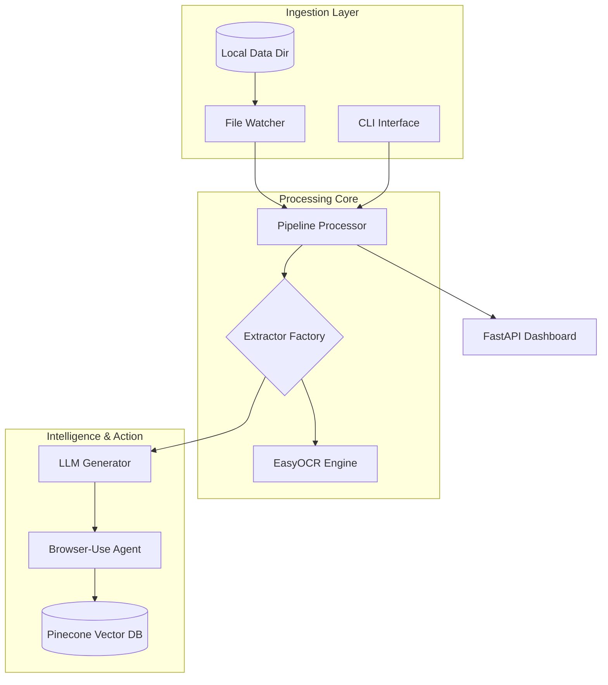
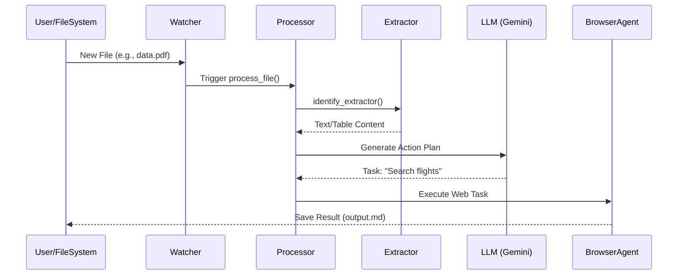
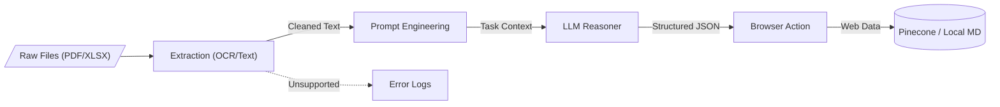

<!--
  Generated by AI-Powered README Generator
  Repository: https://github.com/WomB0ComB0/browser-use
  Generated: 2026-01-31T00:39:08.994Z
  Format: md
  Style: comprehensive
-->

# Enterprise Data Pipeline (Browser-Use)

An automated, LLM-powered data extraction and web-automation pipeline designed to transform unstructured files into actionable insights and execute complex browser tasks.


## Table of Contents
- [Overview](#overview)
- [Features](#features)
- [Architecture](#architecture)
- [Quick Start](#quick-start)
- [Usage & Examples](#usage--examples)
- [Configuration](#configuration)
- [API Reference](#api-reference)
- [Development](#development)
- [Troubleshooting](#troubleshooting)
- [Contributing](#contributing)
- [Roadmap & Known Issues](#roadmap--known-issues)
- [License & Credits](#license--credits)

## Overview
The **Enterprise Data Pipeline** is a robust framework built to bridge the gap between static data extraction and dynamic web action. It monitors local directories for various file formats (PDF, XLSX, CSV, JSON, etc.), extracts their content using specialized engines (including OCR), and passes that data to Large Language Models (LLMs) like Google Gemini or Ollama. 

Unlike traditional ETL tools, this pipeline integrates **Browser-Use**, allowing the system to not only analyze data but also act upon it—such as navigating websites, performing price comparisons, or filling out web forms based on the processed information.

**Who is this for?**
*   **Data Engineers** building automated document processing workflows.
*   **RPA Developers** looking for LLM-native browser automation.
*   **Analysts** needing to automate repetitive data-gathering tasks from the web.
*   **DevOps Teams** requiring a self-healing, file-triggered execution engine.

## Features

### 📂 Multimodal Extraction
*   ✨ **Universal Support:** Native extractors for `.txt`, `.md`, `.json`, `.csv`, `.pdf`, and `.xlsx`.
*   👁️ **OCR Integration:** Built-in `easyocr` support for processing scanned images and complex PDF layouts.
*   ⚡ **Async Processing:** Concurrent file handling using `aiofiles` and multi-worker architecture.

### 🤖 LLM & Browser Automation
*   🎯 **Browser-Use Integration:** Seamlessly control Chromium-based browsers via LLM instructions.
*   🧠 **Dual Provider Support:** Use Google Gemini (Native or LangChain) for cloud-scale or Ollama for local-first privacy.
*   🔄 **Workflow Orchestration:** Define complex multi-step tasks in YAML (e.g., Code Review, Data Analysis).

### 🛠️ Enterprise Ready
*   📊 **Real-time Dashboard:** Built-in FastAPI/Websocket dashboard for monitoring pipeline health.
*   💾 **Vector Memory:** Integrated Pinecone service for long-term document context and RAG.
*   🕵️ **File Watcher:** Robust `watchdog` implementation to trigger events on file creation or modification.

## Architecture

### System Component Map


### Sequence: File Processing Flow


### Data Transformation Flow


### Tech Stack
| Layer | Technology | Purpose |
| :--- | :--- | :--- |
| **Language** | Python 3.10+ | Core logic and scripting |
| **LLM Interface** | LangChain / ChatGoogle | Abstracted LLM communication |
| **Automation** | Playwright / Browser-Use | Headless browser control |
| **Database** | Pinecone | Vector storage for RAG workflows |
| **UI** | FastAPI / Rich | Dashboard and CLI feedback |

## Quick Start

### Prerequisites
*   Python 3.10 or higher
*   Playwright dependencies: `playwright install`
*   (Optional) Tesseract/EasyOCR dependencies for images

### Installation
1.  **Clone the repository:**
    ```bash
    git clone https://github.com/WomB0ComB0/browser-use.git
    cd browser-use
    ```

2.  **Install dependencies:**
    ```bash
    pip install -r requirements.txt
    playwright install chromium
    ```

3.  **Configure Environment:**
    ```bash
    cp .env.example .env
    # Edit .env with your GEMINI_API_KEY
    ```

### Hello World (Agent Demo)
Run the native Gemini agent to perform a web search task:
```bash
python demo_gemini_native.py
```
**Expected Output:**
```text
Agent: Searching for JFK to LHR flights...
Result: The cheapest flight found is $458 via Norse Atlantic.
```

## Usage & Examples

### 1. Running the Pipeline
The pipeline can run in "Watch Mode" to monitor a directory continuously.
```bash
# Start watching the data/ directory
python run_pipeline.py start --config config.yaml
```

### 2. Processing a Specific File
For one-off tasks, use the `process` command:
```bash
python run_pipeline.py process ./data/sample_users.txt --workflow data_analysis
```

### 3. Advanced Workflow Example
Workflows are defined in `pipeline/workflows/`. You can trigger complex logic by passing the workflow flag.
```yaml
# Example: pipeline/workflows/code_review.yaml
steps:
  - action: "extract_code"
  - action: "analyze_with_llm"
  - action: "post_to_github_pr"
```

<details>
<summary>View Programmatic Usage</summary>

```python
from pipeline.config import PipelineConfig
from pipeline.processor import PipelineProcessor

async def custom_run():
    cfg = PipelineConfig.load("config.yaml")
    processor = PipelineProcessor(cfg)
    processor.initialize()
    
    await processor.process_file("path/to/data.pdf")

if __name__ == "__main__":
    import asyncio
    asyncio.run(custom_run())
```
</details>

## Configuration

### Config.yaml
The main configuration file controls the pipeline's behavior.

| Variable | Type | Default | Description |
| :--- | :--- | :--- | :--- |
| `directories.data` | String | `"data"` | Source directory for file watching |
| `processing.concurrent_workers` | Integer | `4` | Number of files to process in parallel |
| `generator.provider` | String | `"gemini"` | LLM provider (`gemini` or `ollama`) |
| `generator.temperature` | Float | `0.7` | Creativity setting for the LLM |

### Environment Variables (.env)
| Variable | Required | Description |
| :--- | :--- | :--- |
| `GEMINI_API_KEY` | Yes (if using Gemini) | Google AI Studio API Key |
| `PINECONE_API_KEY` | No | Required for vector memory features |
| `HF_TOKEN` | No | HuggingFace token for specialized models |

## API Reference

### `PipelineProcessor`
The core engine responsible for file lifecycle management.

*   `initialize()`: Loads models and prepares directory structures.
*   `process_file(path: Path, workflow_name: str)`: Executes the full extraction and LLM chain on a file.
*   `stop()`: Gracefully shuts down workers and file watchers.

### `BaseExtractor`
All file extractors inherit from this class.

| Method | Parameters | Returns |
| :--- | :--- | :--- |
| `extract()` | `file_path: Path` | `str` (Extracted Text) |
| `validate()` | `file_path: Path` | `bool` |

## Development

### Project Structure
```text
├── pipeline/
│   ├── extractors/    # Format-specific parsing logic
│   ├── generators/    # LLM provider implementations
│   ├── memory/        # Pinecone/Vector DB integration
│   ├── utils/         # Browser execution & metrics
│   └── workflows/     # YAML-based task definitions
├── tests/             # Integration & Unit tests
└── run_pipeline.py    # Main entry point
```

### Running Tests
```bash
pytest tests/test_integration.py
```

## Troubleshooting

| Error | Cause | Solution |
| :--- | :--- | :--- |
| `GEMINI_API_KEY not found` | Environment variable not loaded | Ensure `.env` exists or `export` the key in your shell. |
| `Executable not found` | Playwright browser missing | Run `playwright install chromium`. |
| `OutOfMemoryError` | Processing massive PDF/XLSX | Increase `concurrent_workers` or check system RAM; use OCR only when necessary. |

## Contributing
1.  Fork the repository.
2.  Create a feature branch: `git checkout -b feature/amazing-feature`.
3.  Commit changes: `git commit -m 'Add amazing feature'`.
4.  Push to branch: `git push origin feature/amazing-feature`.
5.  Open a Pull Request.

**Commit Convention:** Please use [Conventional Commits](https://www.conventionalcommits.org/) (e.g., `feat:`, `fix:`, `docs:`).

## Roadmap & Known Issues
- [x] Multi-format extraction (PDF, CSV, XLSX)
- [x] Google Gemini Native Integration
- [ ] Local Llama 3 support via Ollama optimization
- [ ] Multi-agent orchestration for parallel web tasks
- [ ] Integrated Web Dashboard for real-time log streaming

⚠️ **Known Issue:** OCR extraction on rotated images can occasionally fail; use high-contrast scans for best results.

## License & Credits
Distributed under the MIT License. See `LICENSE` for more information.

**Key Dependencies:**
*   [Browser-Use](https://github.com/browser-use/browser-use) - The core browser automation agent.
*   [LangChain](https://github.com/langchain-ai/langchain) - LLM orchestration.
*   [Playwright](https://playwright.dev/) - Browser control.

**Maintainer:** @WomB0ComB0