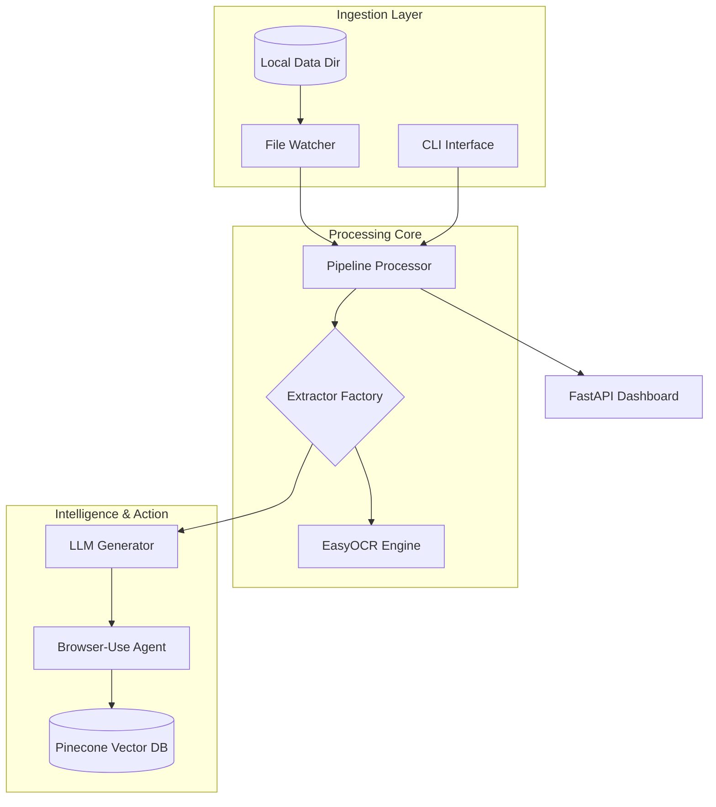
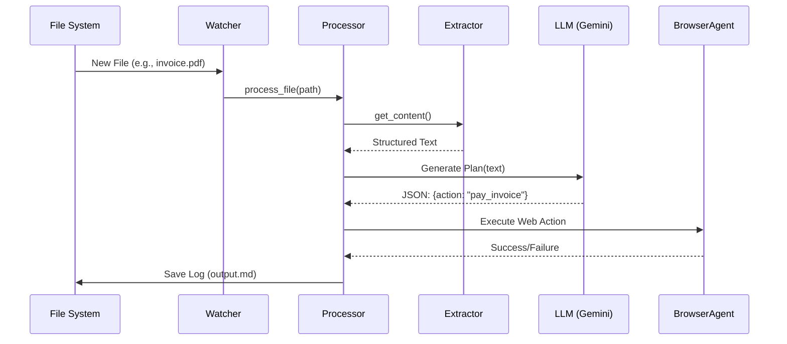

<!--
  Generated by AI-Powered README Generator
  Repository: https://github.com/WomB0ComB0/browser-use
  Generated: 2026-02-01T03:30:33.853Z
  Format: md
  Style: comprehensive
-->

# Enterprise Data Pipeline (Browser-Use)

Automated, LLM-powered data extraction and web-automation pipeline designed to transform unstructured files into actionable insights and execute complex browser tasks.


## 2. Table of Contents

- [Overview](#overview)
- [Features](#features)
- [Architecture](#architecture)
- [Quick Start](#quick-start)
- [Usage & Examples](#usage--examples)
- [Configuration](#configuration)
- [API Reference](#api-reference)
- [Troubleshooting](#troubleshooting)
- [Performance & Security](#performance--security)
- [Development](#development)
- [Contributing](#contributing)
- [Roadmap & Known Issues](#roadmap--known-issues)
- [License & Credits](#license--credits)

## 3. Overview

The **Enterprise Data Pipeline** is a robust framework built to bridge the gap between static data extraction and dynamic web action. Organizations often struggle with "siloed data" trapped in PDFs, spreadsheets, and images that require manual entry into web portals or internal tools. This repository provides a solution by monitoring local directories for various file formats, extracting their content using specialized engines (including OCR), and passing that data to Large Language Models (LLMs) to drive automated browser agents.

By integrating **Browser-Use**, the system goes beyond traditional ETL (Extract, Transform, Load). It acts as a digital worker that can navigate complex websites, perform price comparisons, or fill out web forms based on the processed information. Whether you are using Google Gemini for cloud-scale reasoning or Ollama for local-first privacy, the pipeline offers a flexible, event-driven architecture.

**Who is this for?**
*   **Data Engineers:** Building automated document processing and ingestion workflows.
*   **RPA Developers:** Transitioning from brittle, selector-based automation to LLM-native agents.
*   **Operations Teams:** Needing to automate repetitive data-gathering or form-filling tasks.
*   **Product Teams:** Prototyping AI agents that require real-time web interaction.

## 4. Features

### 📂 Multimodal Extraction
*   ✨ **Universal Support:** Native extractors for `.txt`, `.md`, `.json`, `.csv`, `.pdf`, and `.xlsx`.
*   👁️ **OCR Integration:** Built-in `easyocr` support for processing scanned images and complex PDF layouts.
*   ⚡ **Async Processing:** Concurrent file handling using `aiofiles` and multi-worker architecture.

### 🤖 LLM & Browser Automation
*   🎯 **Browser-Use Integration:** Control Chromium-based browsers via natural language instructions.
*   🧠 **Dual Provider Support:** Use Google Gemini (Native/LangChain) or Ollama for local execution.
*   🔄 **Workflow Orchestration:** Define multi-step tasks in YAML (e.g., Code Review, Data Analysis).

### 🛠️ Enterprise Ready
*   📊 **Real-time Dashboard:** Built-in FastAPI/Websocket dashboard for monitoring agent health.
*   💾 **Vector Memory:** Integrated Pinecone service for long-term document context and RAG.
*   🕵️ **File Watcher:** Robust `watchdog` implementation to trigger events on file updates.

## 5. Architecture

The system follows a modular architecture where the `PipelineProcessor` acts as the central hub, coordinating between filesystem events, data extractors, and LLM generators.

### High-Level Architecture


### Runtime Sequence Diagram


### Tech Stack
| Layer | Technology | Purpose |
| :--- | :--- | :--- |
| **Language** | Python 3.10+ | Core logic and scripting |
| **LLM Interface** | LangChain / ChatGoogle | Abstracted LLM communication |
| **Automation** | Playwright / Browser-Use | Headless browser control |
| **Database** | Pinecone | Vector storage for RAG workflows |
| **UI** | FastAPI / Tailwind | Dashboard and monitoring |

## 6. Quick Start

### Prerequisites
*   Python 3.10 or 3.11 (3.12 support is experimental)
*   Playwright dependencies: `playwright install`
*   A Google Gemini API Key or a local Ollama instance

### Installation
1.  **Clone the repository:**
    ```bash
    git clone https://github.com/WomB0ComB0/browser-use.git
    cd browser-use
    ```

2.  **Install dependencies:**
    ```bash
    pip install -r requirements.txt
    playwright install chromium
    ```

3.  **Configure Environment:**
    ```bash
    cp .env.example .env
    # Edit .env and add your GEMINI_API_KEY
    ```

### Hello World (Agent Demo)
Run the Gemini native demo to verify your setup:
```bash
python demo_gemini_native.py
```
**Expected Output:**
```text
[Browser-Use] Initializing session...
[Agent] Task: Search for latest news on autonomous agents.
[Browser] Navigating to google.com...
[Result] Found 5 articles. Summary: Agents are becoming more autonomous...
```

## 7. Usage & Examples

### 1. Running the Pipeline (Watch Mode)
Monitor the `data/` directory for new files and process them automatically.
```bash
python run_pipeline.py start --config config.yaml
```

### 2. Manual Processing
Force the pipeline to process a specific file with a dedicated workflow.
```bash
python run_pipeline.py process ./data/sample_users.txt --workflow data_analysis
```

### 3. Integrated Dashboard
Launch the web-based monitoring tool:
```bash
python -m pipeline.dashboard.app
# Open http://localhost:8000 in your browser
```

<details>
<summary>Advanced: Parallel Browser Execution</summary>

To run multiple browser agents in parallel (e.g., for price scraping), use the `demo_parallel.yaml` workflow:
```bash
python run_pipeline.py process ./data/items.csv --workflow demo_parallel
```
This leverages Python's `asyncio.gather` within the orchestrator to handle multiple browser instances concurrently.
</details>

## 8. Configuration

### Config.yaml Schema
The behavior of the processor and extractors is defined in `config.yaml`.

| Variable | Default | Description |
| :--- | :--- | :--- |
| `directories.data` | `./data` | Where the watcher looks for files |
| `processing.workers` | `4` | Concurrent files being extracted |
| `generator.provider` | `gemini` | `gemini` or `ollama` |
| `browser.headless` | `true` | Set to `false` to see the browser window |
| `memory.enabled` | `false` | Enable/Disable Pinecone vector storage |

### Environment Variables (.env)
| Variable | Required | Description |
| :--- | :--- | :--- |
| `GEMINI_API_KEY` | Yes (if Gemini) | Google AI Studio API Key |
| `PINECONE_API_KEY` | No | API Key for vector memory |
| `OLLAMA_BASE_URL` | No | Defaults to `http://localhost:11434` |
| `LOG_LEVEL` | No | `DEBUG`, `INFO`, `WARNING`, `ERROR` |

## 9. API Reference

### `PipelineProcessor` Class
The core engine for handling file-to-action logic.

| Method | Parameters | Description |
| :--- | :--- | :--- |
| `initialize()` | None | Sets up extractors and LLM clients. |
| `process_file(path)` | `path: str` | Extracts content and runs the LLM agent. |
| `get_metrics()` | None | Returns stats on processed files/errors. |

### `ExtractorFactory`
Utility to determine the correct parsing strategy.

| Function | Input | Returns |
| :--- | :--- | :--- |
| `get_extractor(ext)` | `.pdf`, `.csv`, etc. | `BaseExtractor` implementation |

## 10. Troubleshooting

| Error Message | Cause | Solution |
| :--- | :--- | :--- |
| `Executable not found` | Playwright not initialized | Run `playwright install chromium` |
| `401 Unauthorized` | Invalid API Key | Check `GEMINI_API_KEY` in your `.env` |
| `OCR failed` | Missing system libs | Install `tesseract-ocr` or `libGL` for EasyOCR |
| `TimeoutError` | Slow web response | Increase `browser.timeout` in `config.yaml` |

## 11. Development

### Project Structure
*   `pipeline/processor.py`: Orchestrates the movement of data.
*   `pipeline/extractors/`: Individual logic for PDF, Excel, OCR, etc.
*   `pipeline/generators/`: LLM provider implementations (Gemini, Ollama).
*   `pipeline/utils/browser_executor.py`: Wrapper for Browser-Use actions.

### Running Tests
We use `pytest` for unit and integration testing.
```bash
pytest tests/test_orchestrator.py
pytest tests/test_ollama.py
```

## 12. Roadmap & Known Issues

- [ ] Support for Local Llama 3 via Ollama tool-calling.
- [ ] Integration with LangGraph for more complex stateful loops.
- [ ] Dockerized deployment for headless worker nodes.
- [ ] Support for multi-modal Gemini (Pro Vision) for image-based browser navigation.

⚠️ **Known Issues:**
*   **Memory Leaks:** Long-running sessions in non-headless mode may consume high RAM.
*   **Shadow DOM:** Browser-Use may occasionally fail to find elements inside deep Shadow DOM structures.

## 13. License & Credits

- **License:** MIT License. See [LICENSE](LICENSE) for details.
- **Inspirations:** Built using the [browser-use](https://github.com/browser-use/browser-use) library and [LangChain](https://github.com/langchain-ai/langchain).
- **Maintainer:** [WomB0ComB0](https://github.com/WomB0ComB0)